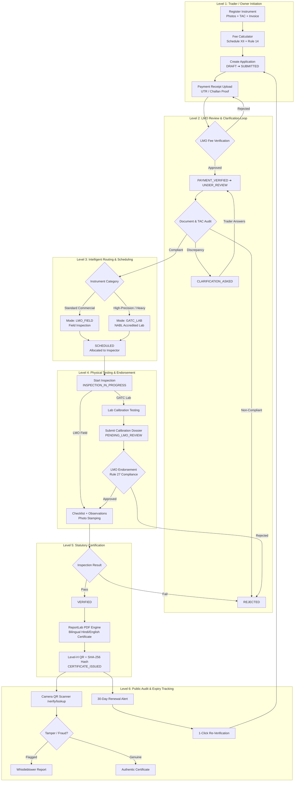

# METRIX

> **Online Verification and Digital Certification System for Weighing and Measuring Instruments**  
> *Developed for Smart India Hackathon Problem Statement SIH26036 (Department of Consumer Affairs, Legal Metrology Division)*

---

## 1. System Overview

**METRIX** is an enterprise-grade Legal Metrology automation platform designed to digitize the statutory lifecycle for commercial weighing and measuring instruments in accordance with the Legal Metrology Act, 2009 and the Legal Metrology (General) Rules, 2011.

The platform provides end-to-end digital governance across 5 statutory actors:
- **Instrument Owners / Traders**: Register instruments with TAC certificates & invoices, calculate statutory fees, submit applications, and upload payment receipts.
- **Legal Metrology Officers (LMOs)**: Conduct field verifications, perform category-specific checklists, log physical observations, endorse GATC laboratory dossiers, verify fees, and issue digitally signed certificates.
- **Government Approved Test Centres (GATCs)**: Carry out specialized calibration and verification testing on precision instruments, flow meters, and weighbridges, generating formal laboratory dossiers for LMO approval.
- **State & National Administrators**: Monitor cross-jurisdictional verification queues, inspect real-time system health & PostgreSQL connection pools, audit stakeholder activity, and broadcast gazette notifications.
- **Public & Consumers**: Scan high-correction QR codes via real-time camera or lookup certificate numbers to verify authenticity and report suspicious or tampered certificates.

---

## 2. Multi-Level Application Lifecycle & Routing



### Detailed Level Routing Criteria:
1. **Level 1 (Trader Initiation)**: Trader submits device particulars, computes Schedule XII fee + late penalty, and uploads payment challan. Status: `DRAFT` ➔ `SUBMITTED` ➔ `PAYMENT_UPLOADED`.
2. **Level 2 (LMO Regulatory Audit & Clarification)**: Officer verifies receipt (`PAYMENT_VERIFIED` ➔ `UNDER_REVIEW`). If documents are ambiguous, LMO triggers `CLARIFICATION_ASKED`. Trader answers inline, returning application to `UNDER_REVIEW`.
3. **Level 3 (Category-Based Routing)**:
   - **`LMO_FIELD`**: Commercial scales, counter/platform scales, beam scales, measures, fuel pumps. Assigned to field LMO.
   - **`GATC_LAB`**: Mandatory for precision balances, micro-balances, custody transfer meters, Coriolis meters, railway weighbridges. Routed to GATC test centres.
4. **Level 4 (Testing & GATC Endorsement)**: Field LMO logs checklists and observations. GATC laboratories test under controlled environments, upload NABL calibration certificates, and recommend `CERTIFY`/`REJECT`. Under **Rule 27**, the assigned LMO reviews and legally endorses the dossier (`PENDING_LMO_REVIEW` ➔ `APPROVED`).
5. **Level 5 (Certification)**: Verified units receive official bilingual PDF certificates with Level H QR codes, anti-copy watermarks, and SHA-256 cryptographic digests.
6. **Level 6 (Citizen Audit & Expiry)**: Consumers scan QR codes; suspicious instruments can be reported via discrepancy reports. 30 days prior to expiry, traders receive automated renewal notices with 1-click re-verification.

---

## 3. Role-Based Portal User Guide

### 🧑‍💼 Instrument Owner / Trader Guide
* **Account**: `trader.owner@metrix.gov.in` / `Owner@123`
1. **Register Instruments (`/instruments`)**: Click *"Register Instrument"*, fill details (serial number, model, capacity), upload device photos, attach TAC certificate and purchase invoice. For fleets, download the CSV template and batch upload up to 100 devices.
2. **Fee Calculator (`/fees`)**: Select instrument type, capacity, and delay days to view the statutory Schedule XII base fee and Rule 14 compounding late fee (+50% per delayed quarter).
3. **Submit Verification (`/applications`)**: Click *"New Application"*, select instrument and verification type (`INITIAL` or `RE_VERIFICATION`), and submit.
4. **Upload Payment Receipt**: Open application, scroll to *Payment Details*, and submit your bank challan/UTR reference and receipt image.
5. **Respond to Clarifications**: If an officer requests information, an alert appears on your application. Enter your answers directly in the clarification banner.
6. **View & Re-Verify Certificates (`/certificates`)**: Download signed bilingual PDFs. When an instrument nears expiry (30-day banner), click *"Re-verify Instrument"* to instantly start a renewal application.

---

### 👮 Legal Metrology Officer (LMO) Guide
* **Account**: `lmo.officer@metrix.gov.in` / `Officer@123`
1. **Review Incoming Queue (`/applications`)**: Filter by `PAYMENT_UPLOADED` or `UNDER_REVIEW`. Open application to inspect owner KYC (GSTIN/PAN), instrument photos, and TAC documents.
2. **Verify Fee Payment**: Review uploaded receipt and UTR in the *Payment Card*. Click *"Verify Payment"* (or reject with remarks).
3. **Request Clarification / Schedule**:
   - If documents are insufficient, click *"Request Clarification"*.
   - If valid, click *"Schedule Inspection"*, choose mode (`LMO_FIELD` or `GATC_LAB`), date, time slot, and assign an inspector.
4. **Conduct Field Inspection (`/inspections`)**:
   - Open assigned inspection, click *"Start Inspection"*.
   - Complete the mandatory pre-inspection checklist (visual, zero-load, repeatability).
   - Enter observed values vs statutory standard values.
   - Designate the official certificate stamping photo and submit determination (`VERIFIED` or `REJECTED`).
5. **Endorse GATC Laboratory Dossiers**:
   - Filter queue for `PENDING_LMO_REVIEW`.
   - Open *Review GATC Calibration Dossier* to inspect lab observations, temperature/humidity, and NABL certificates.
   - Endorse (`APPROVE`) to issue a statutory certificate or `REJECT` with legal grounds under Rule 27.

---

### 🔬 Government Approved Test Centre (GATC) Guide
* **Account**: `gatc.lab@metrix.gov.in` / `Lab@123`
1. **Access Lab Queue (`/inspections`)**: View precision balances, weighbridges, and flow meters routed to your test centre.
2. **Execute Lab Calibration**: Click *"Start Inspection"*, conduct NABL calibration tests under controlled ambient conditions.
3. **Submit Calibration Dossier**: Click *"Submit GATC Report"*:
   - Enter laboratory test report URL / calibration certificate reference.
   - Record ambient temperature, humidity, reference standards, and test observations.
   - Choose formal recommendation (`CERTIFY` or `REJECT`) and submit for LMO signoff.

---

### 🛡️ Administrator Guide
* **Account**: `admin@metrix.gov.in` / `Admin@123`
1. **Live Infrastructure Health (`/admin/system`)**: Monitor real-time API Gateway ping, PostgreSQL connection pool metrics, security encryption engine, and multi-tenant user distributions.
2. **User & Officer Management (`/admin/users`)**: Provision LMO officers and GATC testing centres, activate/deactivate accounts, and edit jurisdictions.
3. **Public Notice Board (`/notices`)**: Publish and manage official gazette notifications and circulars displayed on the citizen landing page.
4. **Operations & Reports (`/reports` & `/analytics`)**: Generate regulatory CSV exports and analyze verification throughput, rejection reasons, and expiry forecasts.

---

### 🌐 Public Consumer & Enforcement Guide
* **No Login Required**
1. **Camera QR Code Scanner (`/verify/lookup`)**: Open the scanner on any mobile browser or desktop webcam. Position the certificate's Level H QR code in the viewport.
2. **Certificate Search**: Enter the Certificate Identification Number (e.g. `CERT-2026-...`) to view validity status, owner, inspector, and valid-until date.
3. **Anti-Tampering Integrity**: Check the cryptographic SHA-256 fingerprint to verify the physical certificate matches the government database.
4. **Report Discrepancy**: Click *"Report Suspicious Certificate"* to lodge a whistleblower report for tampered, cloned, or malfunctioning equipment.

---

## 4. Technology Stack & Constraints

- **Backend**: Python 3.12 (FastAPI, Pydantic v2, SQLAlchemy 2.x, Alembic, PostgreSQL, Pytest)
- **Frontend**: Next.js 14 (App Router), TypeScript, Tailwind CSS, Redux Toolkit, RTK Query
- **Certificates & QR**: ReportLab A4 PDF Engine (bilingual Hindi/English), `qrcode` (Level H), SHA-256 Digest
- **Camera Stream Scanner**: `html5-qrcode` real-time camera decoder
- **Architecture**: Software-Only Modular Monolith (Strictly No Docker, Kubernetes, Celery, or Redis)
- **Strict Line Limits**: Python <= 500 lines, TS/TSX <= 300 lines, Tests <= 500 lines.

---

## 5. Local Setup & Execution Guide

### Prerequisites
- Python 3.10+ (Python 3.12 recommended) & Node.js 18+ (Node.js 20 LTS recommended)
- PostgreSQL 14+ running locally on port 5432 (database: `metrix_db`)

### 1. Backend Setup
```bash
cd backend
python -m venv .venv
.\.venv\Scripts\Activate.ps1    # On Windows (or source .venv/bin/activate on Unix)
pip install -r requirements.txt
alembic upgrade head
python app/scripts/seed_dev_users.py
uvicorn app.main:app --reload --port 8000
```
- Swagger API Docs: `http://localhost:8000/docs` | Health Check: `http://localhost:8000/api/v1/health`

### 2. Frontend Setup
```bash
cd frontend
npm install
npm run dev
```
- Web Application: `http://localhost:3000` | Fee Calculator: `http://localhost:3000/fees` | QR Scanner: `http://localhost:3000/verify/lookup`

---

## 6. Seeded Demonstration Accounts

| Role | Email Address | Password | Primary Accessible Portals |
| :--- | :--- | :--- | :--- |
| **Administrator** | `admin@metrix.gov.in` | `Admin@123` | System Health, User Management, Analytics, Notice Board |
| **Legal Metrology Officer (LMO)** | `lmo.officer@metrix.gov.in` | `Officer@123` | Inspections Queue, GATC Review, Fee Verification, Certificate Issuance |
| **GATC Test Centre** | `gatc.lab@metrix.gov.in` | `Lab@123` | Laboratory Calibrations Queue, Calibration Dossier Upload Modal |
| **Instrument Owner** | `trader.owner@metrix.gov.in` | `Owner@123` | Instrument Registration, Fee Calculator, Payment Receipts, Re-Verification |

---

## 7. Next.js Route Catalog (21 Compiled Routes)

| Route | Access Level | Description |
| :--- | :--- | :--- |
| `/` | Public | Citizen landing page, statutory notice board, lifecycle workflow explainer |
| `/login` | Public | Multi-mode login (Password, OTP, Google SSO, and 1-click role logins) |
| `/auth/google/callback` | Public | Google OAuth callback handler |
| `/verify/lookup` | Public | Live camera QR code scanner & certificate lookup portal |
| `/verify/[token]` | Public | Public certificate verification view with tamper-check & discrepancy reporter |
| `/fees` | Authenticated / Public | Statutory Schedule XII fee calculator with Rule 14 delay penalty slider |
| `/dashboard` | Authenticated | Operational metrics, role-specific action items, and live statistics |
| `/instruments` | Authenticated | Instrument inventory, batch CSV template download, and multi-photo registration |
| `/instruments/[id]` | Authenticated | Instrument particulars, TAC/invoice links, and historical certificates |
| `/applications` | Authenticated | Verification applications pipeline with tabbed status filtering |
| `/applications/[id]` | Authenticated | Application state machine, payment card, clarification loop, and scheduling |
| `/inspections` | LMO, GATC, Admin | Inspection queue with status tabs, assigned-only filter, and PDF report downloads |
| `/certificates` | Authenticated | Certificate registry with active/expiring/expired tabs and bulk actions |
| `/certificates/[id]` | Authenticated | Certificate dossier with QR preview, SHA-256 digest, and re-verify action |
| `/analytics` | Authenticated | Regulatory analytics dashboard with distribution trends and charts |
| `/notices` | Authenticated | Administrative notice board manager and public gazette circular feed |
| `/notifications` | Authenticated | In-app notification center with read/unread filtering |
| `/profile` | Authenticated | User account settings, trader KYC fields (GSTIN/PAN), and password updates |
| `/reports` | Authenticated | Regulatory & operational CSV export generator |
| `/search` | Authenticated | Global cross-entity search across instruments, applications, and certificates |
| `/admin/system` | Admin | Real-time system health, database connection pool, and tenancy breakdown |

---

## 8. REST API Summary (70+ Endpoints)

- **Authentication & KYC**: `POST /auth/register`, `POST /auth/login`, `GET|PATCH /auth/me`, `PATCH /auth/me/password`, `POST /auth/otp/send`, `POST /auth/otp/verify`, `GET|POST /auth/google*`
- **Statutory Fee Engine**: `GET /fees/calculate`
- **Instruments**: `POST|GET /instruments`, `GET /instruments/csv-template`, `POST /instruments/batch-upload`, `GET|PATCH /instruments/{id}`, `PATCH /instruments/{id}/deactivate`, `POST|DELETE /instruments/{id}/images*`
- **Applications & Payments**: `POST|GET /applications`, `GET|DELETE /applications/{id}`, `PATCH /applications/{id}/status`, `PATCH /applications/{id}/schedule`, `PATCH /applications/{id}/assignment`, `POST /applications/{id}/payment-receipt`, `POST /applications/{id}/verify-payment`, `POST /applications/{id}/request-clarification`, `POST /applications/{id}/submit-clarification`
- **Inspections & Calibrations**: `GET /inspections`, `GET /inspections/{id}`, `POST /applications/{id}/inspection`, `POST|GET /inspections/{id}/observations`, `PATCH /inspections/{id}/result`, `POST /inspections/{id}/images`, `PATCH /inspections/{id}/certificate-image`, `POST /inspections/{id}/gatc-report`, `PATCH /inspections/{id}/lmo-approval`, `GET /inspections/{id}/report/download`
- **Certificates & Verification**: `POST|GET /applications/{id}/certificate`, `GET /certificates`, `GET /certificates/{id}`, `GET /certificates/{id}/download`, `GET /certificates/expiring`, `GET /certificates/expired`, `GET /public/certificates/verify/{token}`, `GET /public/certificates/lookup/{number}`, `POST /certificates/report-discrepancy`
- **System Health & Governance**: `GET /health`, `GET /dashboard/summary`, `GET /dashboard/charts`, `GET|POST|PATCH /notifications*`, `GET|POST|DELETE /notices*`, `GET /reports/*`

---

## 9. Quality Assurance & Engineering Standards

- **Backend Pytest Suite**: 65 comprehensive automated tests passing with 100% success rate:
  ```bash
  cd backend
  .venv\Scripts\pytest tests/
  ```
- **Frontend Type Safety & Build**: 0 TypeScript compilation errors; 21/21 App Router pages statically and dynamically optimized:
  ```bash
  cd frontend
  npm run build
  ```
- **Mandatory File Line Limits**: Strictly <= 500 lines for Python, strictly <= 300 lines for TS/TSX.
