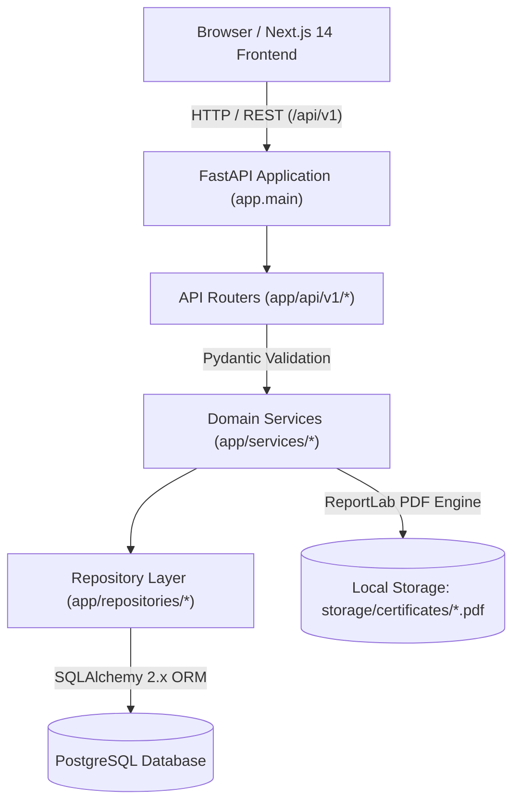

# METRIX — System Architecture

> **Document Status**: CURRENT STATE (Post-Phase 6 Verified)  
> **Master Index**: See [docs/DOCUMENTATION_INDEX.md](DOCUMENTATION_INDEX.md).

---

## 1. Architectural Style: Modular Monolith

METRIX is architected as a clean, software-only **modular monolith**. It decomposes domain concerns into decoupled layers without introducing the operational overhead, network latency, or deployment complexity of microservices or external message brokers.



---

## 2. Backend Layering & Dependency Flow

The backend enforces strict unidirectional dependency flow:
$$\text{Router} \longrightarrow \text{Service} \longrightarrow \text{Repository} \longrightarrow \text{SQLAlchemy ORM} \longrightarrow \text{PostgreSQL}$$

### 1. API Routers (`backend/app/api/v1/`)
- Thin HTTP controllers responsible for route matching, dependency injection, and HTTP status codes.
- Validate request payloads via Pydantic schemas.
- Enforce authentication (`get_current_user`) and role authorization (`require_role`).
- Delegate all business logic to domain services.

### 2. Service Layer (`backend/app/services/`)
- Enforces statutory business logic, state machine invariants, and multi-table transactions.
- Orchestrates PDF rendering, cryptographic hashing, and in-app notification dispatching.
- Contains domain services: `AuthService`, `InstrumentService`, `ApplicationService`, `InspectionService`, `CertificateService`, `NotificationService`, `ReportService`, `DashboardService`.

### 3. Repository Layer (`backend/app/repositories/`)
- Abstract persistence and query execution layer.
- Encapsulates SQLAlchemy queries, joins (`joinedload`, `selectinload`), pagination, and database-level aggregations.
- Prevents ORM queries from leaking into router endpoints.

### 4. Data Layer (`backend/app/models/` & `backend/app/db/`)
- SQLAlchemy 2.x declarative models mapping database tables.
- Central database engine and scoped session lifecycle management.

---

## 3. Frontend Architecture

The frontend is built using Next.js 14 with the App Router, structured by feature modules:

```text
frontend/src/
├── app/                        # Route pages and layout wrappers
├── components/                 # Shared UI primitives and navigation
│   ├── auth/                   # AuthInitializer session provider
│   ├── layout/                 # HeaderNav, footers
│   └── ui/                     # Generic modal and button components
├── features/                   # Feature-sliced components and API hooks
│   ├── auth/                   # LoginForm, RegisterForm, authSlice
│   ├── instruments/            # RegisterInstrumentModal, instrumentApi
│   ├── applications/           # Timeline, modals (Assign, Schedule, Result)
│   ├── certificates/           # CertificateCard, IssueCertificateModal
│   ├── dashboard/              # Role-specific dashboard widgets
│   └── notifications/          # Notification drawer and badge
├── store/                      # Redux Toolkit store & typed hooks
├── types/                      # TypeScript domain types
└── services/                   # Base fetch client configuration
```

- **Client Session Management**: Redux Toolkit manages active session state; `AuthInitializer` restores authenticated user state from local storage on browser reload.
- **Server Data Caching**: RTK Query handles automated caching, request deduplication, and cache invalidation.

---

## 4. Document & Storage Architecture

METRIX segregates relational data from binary file assets:
- **Relational Data**: All user accounts, application logs, observations, and certificate metadata are stored in PostgreSQL.
- **Binary PDF Storage**: Generated certificate PDFs are stored on the local filesystem in `backend/storage/certificates/` and served dynamically via streaming HTTP endpoints (`GET /api/v1/certificates/{id}/download`).
- This design honors the software-only constraint by avoiding third-party cloud object stores (e.g. AWS S3).

---

## 5. Public Verification & Security Boundary

Unauthenticated public users verify instruments via a dedicated zero-login route:
```text
Consumer Scans QR Code
       │
       ▼
Next.js Route: /verify/[token]
       │ (HTTP GET)
       ▼
FastAPI Route: /api/v1/public/certificates/verify/{verification_token}
       │
       ▼
CertificateService validates token & calculates dynamic expiry
       │
       ▼
Returns public JSON (Instrument specs, validity window, SHA-256 hash)
(Private applicant details and officer notes are strictly excluded)
```

---

## 6. Architectural Rules & Constraints Summary

1. **No Distributed Infrastructure**: The entire stack runs directly on the host operating system in separate terminal processes.
2. **Thin Routers**: Route handlers contain zero SQL queries and minimal orchestration logic.
3. **Pydantic vs. Model Separation**: SQLAlchemy ORM models are never directly returned to the API client; all responses are serialized through explicit Pydantic schemas.
4. **Stateless Backend**: Session state is completely encapsulated within signed JWT tokens, allowing easy local restarts without session corruption.
