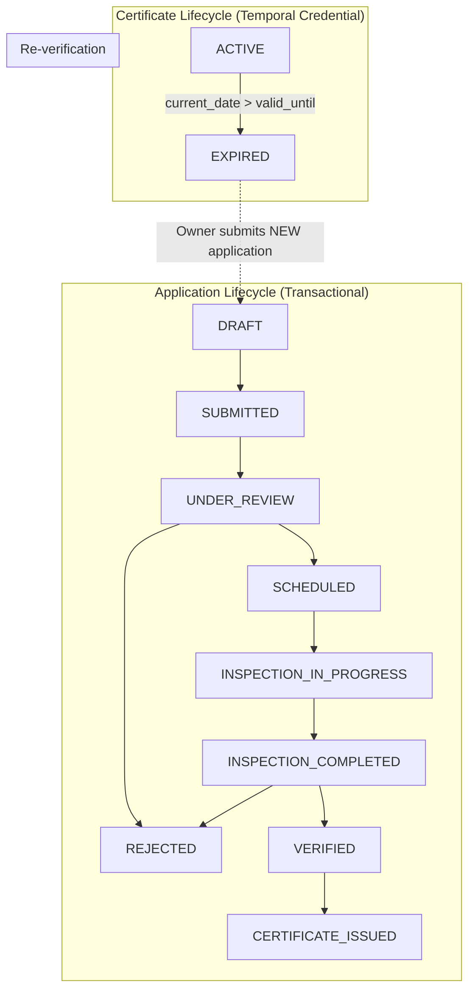
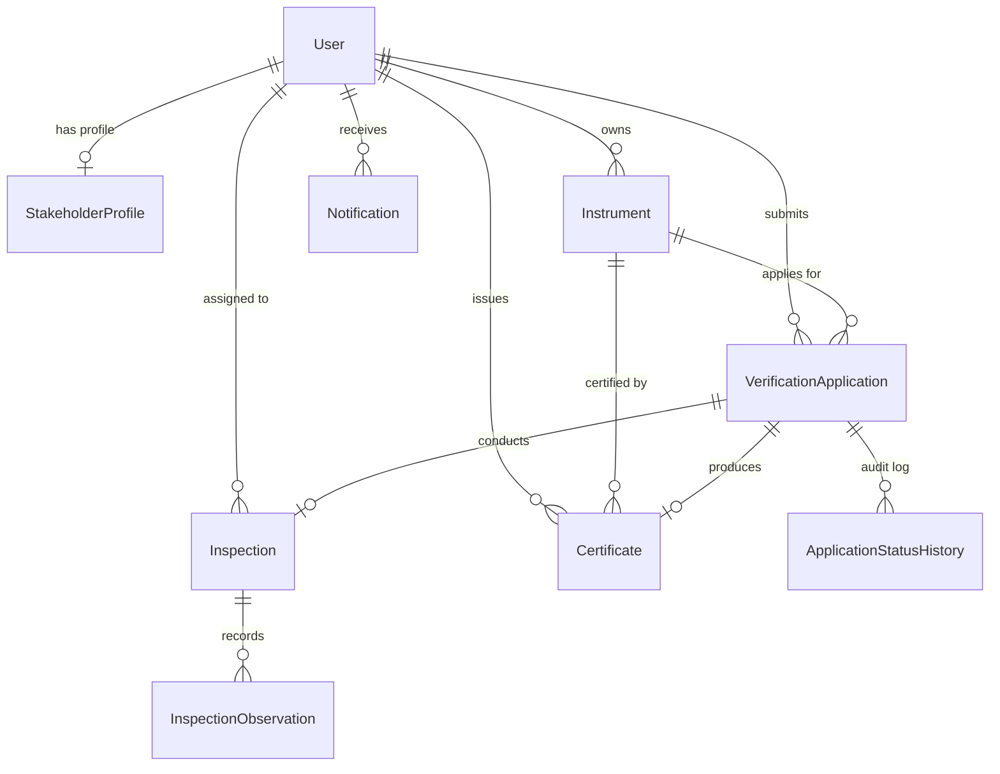

# METRIX — Domain Model

> **Document Status**: CURRENT STATE (Post-Phase 6 Verified)  
> **Master Index**: See [docs/DOCUMENTATION_INDEX.md](DOCUMENTATION_INDEX.md).

---

## 1. Core Domain Philosophy: Decoupled Lifecycles

A foundational architectural principle of METRIX is the strict decoupling of the **Application Lifecycle** from the **Certificate Lifecycle**:

- **Application Invariant**: An application represents a discrete transactional request ending in `CERTIFICATE_ISSUED` or `REJECTED`. `EXPIRED` is never an application status.
- **Certificate Invariant**: A certificate is an issued legal credential whose validity lapses over time (`ACTIVE` → `EXPIRED`).
- **Re-verification Principle**: Periodic re-verification creates a **new** `VerificationApplication` (`application_type='RE_VERIFICATION'`) pointing to the original instrument, preserving historical certificates immutably.

---

## 2. Entity-Relationship Diagram

---

## 3. Detailed Entity Definitions

### 1. `User` (`users`)
- **Purpose**: Authenticated account identity across the platform.
- **Attributes**: `id` (PK), `email` (Unique, Index), `hashed_password`, `full_name`, `role` (`UserRole`), `is_active`, `created_at`, `updated_at`.
- **Relationships**: 1:1 with `StakeholderProfile` (`cascade="all, delete-orphan"`), 1:N with `Instrument`, 1:N with `VerificationApplication`.

### 2. `StakeholderProfile` (`stakeholder_profiles`)
- **Purpose**: Commercial premises or testing laboratory organizational details.
- **Attributes**: `id` (PK), `user_id` (FK `users.id`, Unique), `business_name`, `trade_license_number`, `contact_phone`, `address_line`, `city`, `state`, `pincode`, timestamps.

### 3. `Instrument` (`instruments`)
- **Purpose**: Physical measuring equipment registered for statutory verification.
- **Attributes**: `id` (PK), `registration_number` (Unique, Index), `owner_id` (FK `users.id`, Index), `instrument_type` (`InstrumentType`), `manufacturer`, `model_name`, `serial_number` (Index), `capacity`, `location`, `is_active`, timestamps.

### 4. `VerificationApplication` (`verification_applications`)
- **Purpose**: Legal request for initial verification or periodic re-verification.
- **Attributes**: `id` (PK), `application_number` (Unique, Index), `instrument_id` (FK `instruments.id`, Index), `applicant_id` (FK `users.id`, Index), `application_type` (`"INITIAL"` or `"RE_VERIFICATION"`), `status` (`ApplicationStatus`), `submitted_at`, `remarks`, timestamps.

### 5. `ApplicationStatusHistory` (`application_status_histories`)
- **Purpose**: Append-only audit log tracking every application status transition.
- **Attributes**: `id` (PK), `application_id` (FK `verification_applications.id`), `from_status`, `to_status`, `changed_by_id` (FK `users.id`), `remarks`, `created_at`.

### 6. `Inspection` (`inspections`)
- **Purpose**: Operational field or laboratory inspection appointment.
- **Attributes**: `id` (PK), `application_id` (FK `verification_applications.id`, Unique), `assigned_to_id` (FK `users.id`, Index), `scheduled_date`, `scheduled_time`, `inspection_location`, `scheduling_remarks`, `started_at`, `completed_at`, `result` (`InspectionResult`), `result_remarks`, timestamps.

### 7. `InspectionObservation` (`inspection_observations`)
- **Purpose**: Relational test readings recorded against statutory tolerances.
- **Attributes**: `id` (PK), `inspection_id` (FK `inspections.id`), `parameter_name`, `observed_value`, `standard_value`, `unit`, `is_passed`, `remarks`, `created_at`.

### 8. `Certificate` (`certificates`)
- **Purpose**: Statutory proof of metrological verification.
- **Attributes**: `id` (PK), `certificate_number` (Unique, Index), `application_id` (FK `verification_applications.id`, Unique), `instrument_id` (FK `instruments.id`, Index), `issued_by_id` (FK `users.id`), `issued_at`, `valid_from`, `valid_until` (Index), `status` (`CertificateStatus`), `integrity_hash` (Index), `verification_token` (Unique, Index), `pdf_path`.

### 9. `Notification` (`notifications`)
- **Purpose**: In-app alerts informing users of workflow changes and certificate expiry.
- **Attributes**: `id` (BigInteger PK), `user_id` (FK `users.id`, Index), `type` (`NotificationType`), `title`, `message`, `is_read` (Index), `created_at`, `read_at`, `entity_type`, `entity_id`.

---

## 4. Domain Enumerations

- **`UserRole`**: `ADMIN`, `LMO`, `GATC`, `INSTRUMENT_OWNER`
- **`ApplicationStatus`**: `DRAFT`, `SUBMITTED`, `UNDER_REVIEW`, `SCHEDULED`, `INSPECTION_IN_PROGRESS`, `INSPECTION_COMPLETED`, `VERIFIED`, `CERTIFICATE_ISSUED`, `REJECTED`
- **`InspectionResult`**: `VERIFIED`, `REJECTED`
- **`InstrumentType`**: `WEIGHING_SCALE`, `ELECTRONIC_BALANCE`, `PETROL_DISPENSER`, `FLOW_METER`, `LENGTH_MEASURE`, `OTHER`
- **`CertificateStatus`**: `ACTIVE`, `EXPIRED`
- **`NotificationType`**: `APPLICATION_SUBMITTED`, `APPLICATION_SCHEDULED`, `INSPECTION_ASSIGNED`, `INSPECTION_COMPLETED`, `APPLICATION_VERIFIED`, `APPLICATION_REJECTED`, `CERTIFICATE_ISSUED`, `CERTIFICATE_EXPIRING`, `CERTIFICATE_EXPIRED`
