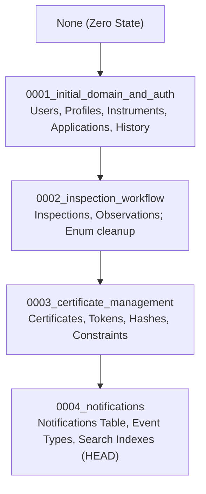

# METRIX — Database & Migration Architecture

> **Document Status**: CURRENT STATE (Post-Phase 6 Verified)  
> **Master Index**: See [docs/DOCUMENTATION_INDEX.md](DOCUMENTATION_INDEX.md).

---

## 1. Database Technology & Configuration

- **Database Engine**: PostgreSQL 14+ (tested on standard relational distributions).
- **ORM & Dialect**: SQLAlchemy 2.x using `postgresql+psycopg2`.
- **Migration Framework**: Alembic managing forward schema evolution.
- **Naming Convention**: `snake_case` for all tables, columns, indexes, and constraints.
- **Transactions**: Explicit transaction context managers wrap multi-table state updates with automatic rollback on error.

---

## 2. Table Schemas & Relational Constraints

| Table Name | Primary Key | Key Foreign Keys | Unique Constraints | Search Indexes |
| :--- | :--- | :--- | :--- | :--- |
| `users` | `id` (Int, Serial) | — | `email` | `ix_users_email`, `ix_users_role` |
| `stakeholder_profiles` | `id` (Int, Serial) | `user_id` → `users.id` (CASCADE) | `user_id` | `ix_stakeholder_profiles_user_id` |
| `instruments` | `id` (Int, Serial) | `owner_id` → `users.id` (RESTRICT) | `registration_number` | `ix_instruments_reg_no`, `ix_instruments_serial_no` |
| `verification_applications` | `id` (Int, Serial) | `instrument_id` → `instruments.id`<br>`applicant_id` → `users.id` | `application_number` | `ix_applications_app_no`, `ix_applications_status` |
| `application_status_histories` | `id` (Int, Serial) | `application_id` → `verification_applications.id`<br>`changed_by_id` → `users.id` | — | `ix_status_history_app_id` |
| `inspections` | `id` (Int, Serial) | `application_id` → `verification_applications.id`<br>`assigned_to_id` → `users.id` | `application_id` | `ix_inspections_assigned_to_id` |
| `inspection_observations` | `id` (Int, Serial) | `inspection_id` → `inspections.id` (CASCADE) | — | `ix_observations_inspection_id` |
| `certificates` | `id` (Int, Serial) | `application_id` → `verification_applications.id`<br>`instrument_id` → `instruments.id`<br>`issued_by_id` → `users.id` | `certificate_number`<br>`application_id`<br>`verification_token` | `ix_certificates_cert_no`, `ix_certificates_token`, `ix_certificates_valid_until` |
| `notifications` | `id` (BigInt, Serial) | `user_id` → `users.id` (CASCADE) | — | `ix_notifications_user_id`, `ix_notifications_is_read` |
| `alembic_version` | `version_num` (VARCHAR 32) | — | — | System schema revision tracker |

---

## 3. Alembic Migration History (Revisions 0001 through 0004)

The database schema has evolved through four sequential migrations:



### Migration Details
1. **`0001_initial_domain_and_auth`**:
   - Initialized `users`, `stakeholder_profiles`, `instruments`, `verification_applications`, and `application_status_histories`.
2. **`0002_inspection_workflow`**:
   - Added `inspections` and `inspection_observations`.
   - Removed `EXPIRED` and `RE_VERIFICATION_REQUESTED` from `application_status` enum on PostgreSQL to enforce clean lifecycle separation.
3. **`0003_certificate_management`**:
   - Added `certificates` table with unique constraints on `certificate_number`, `application_id`, and `verification_token`.
4. **`0004_notifications`**:
   - Added `notifications` table and `notification_type` enum.
   - **Identifier Renaming**: The revision was renamed to `0004_notifications` because the previous revision name (`0004_operations_and_notifications`, 33 chars) exceeded PostgreSQL's 32-character limit for `alembic_version.version_num`.

---

## 4. Operational Migration Commands

To apply database migrations to a running PostgreSQL instance:
```bash
cd backend
alembic upgrade head
```

To inspect the current migration version:
```bash
alembic current
```

To rollback a single revision:
```bash
alembic downgrade -1
```

---

## 5. Data Integrity & Cascade Policies

- **Deletion Restrictions (`ondelete="RESTRICT"`)**:
  - `instruments` cannot be deleted if referenced by applications.
  - `users` cannot be deleted if they own instruments, applications, or certificates.
  - Ensures full non-repudiation and preserves statutory legal evidence.
- **Cascade Deletions (`ondelete="CASCADE"`)**:
  - `stakeholder_profiles` cascade if a draft user account is purged.
  - `inspection_observations` cascade if their parent inspection record is removed.
  - `notifications` cascade if a user account is removed.
