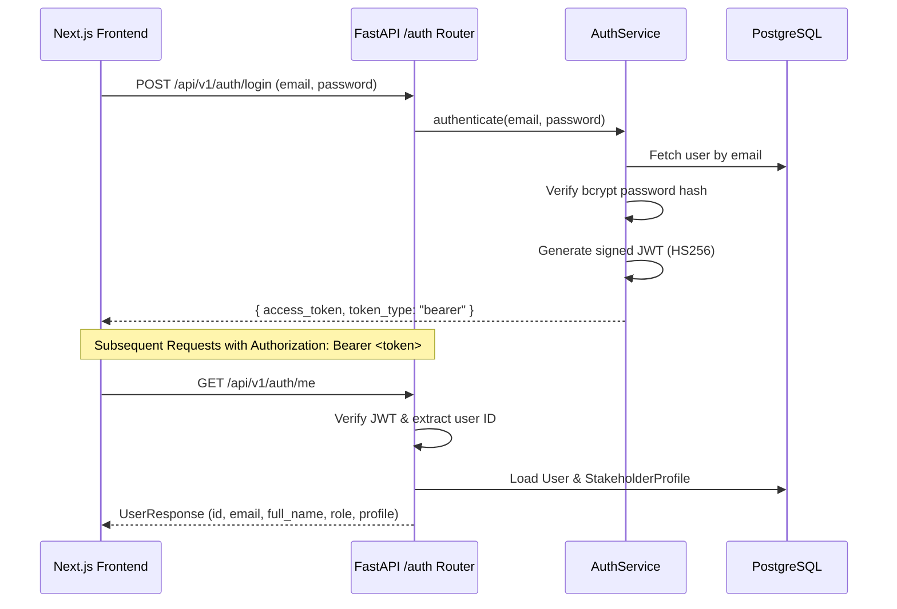

# METRIX — Authentication & Role-Based Access Control (RBAC)

> **Document Status**: CURRENT STATE (Post-Phase 6 Verified)  
> **Master Index**: See [docs/DOCUMENTATION_INDEX.md](DOCUMENTATION_INDEX.md).

---

## 1. Authentication Architecture

METRIX implements centralized, stateless authentication using JSON Web Tokens (JWT) and salted `bcrypt` password hashing.

---

## 2. Core Authentication Endpoints

1. **`POST /api/v1/auth/register`**:
   - Registers a new user account alongside a mandatory `StakeholderProfile`.
   - Restricts self-registration to `INSTRUMENT_OWNER` or `GATC` by default.
   - Enforces unique email constraints and hashes passwords via `get_password_hash`.
2. **`POST /api/v1/auth/login`**:
   - Authenticates credentials against the stored bcrypt hash.
   - Issues a stateless JWT signed with `settings.SECRET_KEY` (`HS256`, 24-hour expiration).
3. **`GET /api/v1/auth/me`**:
   - Validates the bearer token via `get_current_user` FastAPI dependency.
   - Returns user metadata, assigned role, and linked stakeholder profile.

---

## 3. System Roles & RBAC Matrix

METRIX enforces authorization via the `require_role(...)` dependency at the router layer:

| Operational Capability | INSTRUMENT_OWNER | LMO | GATC | ADMIN | Public (No Login) |
| :--- | :---: | :---: | :---: | :---: | :---: |
| **Register Instrument** | **Allowed (Own)** | Allowed | Denied | Allowed | Denied |
| **View Instruments** | **Own Only** | All | Assigned Only | All | Denied |
| **Submit Application** | **Allowed (Own)** | Denied | Denied | Allowed | Denied |
| **Review Application** | Denied | **Allowed** | Denied | **Allowed** | Denied |
| **Schedule Inspection** | Denied | **Allowed** | Denied | **Allowed** | Denied |
| **Assign Verifier** | Denied | **Allowed** | Denied | **Allowed** | Denied |
| **Execute Inspection** | Denied | **Allowed** | **Assigned Only** | **Allowed** | Denied |
| **Record Observations** | Denied | **Allowed** | **Assigned Only** | **Allowed** | Denied |
| **Submit Result** | Denied | **Allowed** | **Assigned Only** | **Allowed** | Denied |
| **Issue Certificate** | Denied | **Allowed** | Denied | **Allowed** | Denied |
| **Download PDF Cert** | **Own Only** | Allowed | Assigned Only | Allowed | Denied |
| **Public QR Verification**| Allowed | Allowed | Allowed | Allowed | **Allowed** |
| **Operational CSV Reports**| **Own Fleet** | All | Assigned Only | All System | Denied |

---

## 4. Role-Based Ownership & Data Isolation

METRIX enforces strict data isolation within a shared relational database:
1. **Instrument Owner Isolation**:
   - In all instrument, application, and certificate queries, records are scoped to `owner_id = current_user.id`.
   - Access to another owner's records triggers `HTTP 404 Not Found` or `HTTP 403 Forbidden` (IDOR prevention).
2. **GATC Assignment Scoping**:
   - Government Approved Test Centres access only those verifications, inspections, and certificates where `assigned_to_id = current_user.id`.
   - GATCs are prevented from viewing unrelated commercial records across the jurisdiction.
3. **Public Endpoint Boundary**:
   - Zero-login access is strictly confined to `GET /api/v1/public/certificates/verify/{token}`.
   - The response model (`PublicCertificateVerificationResponse`) intentionally conceals owner phone numbers, internal database IDs, and officer notes.
