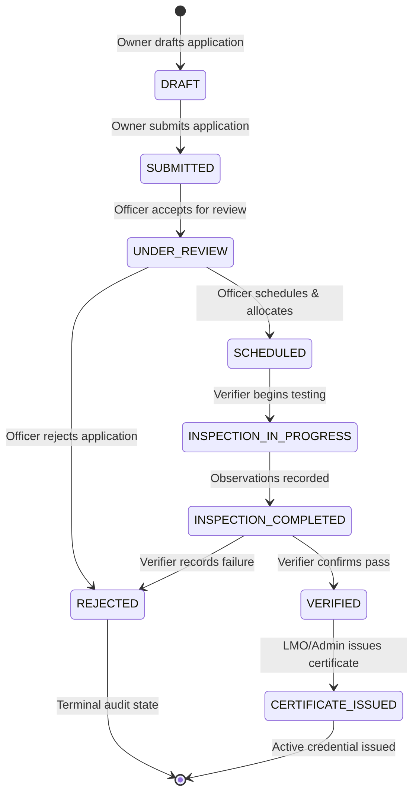

# METRIX — Verification Workflow

> **Document Status**: CURRENT STATE (Post-Phase 6 Verified)  
> **Master Index**: See [docs/DOCUMENTATION_INDEX.md](DOCUMENTATION_INDEX.md).

---

## 1. Statutory Verification Lifecycle

The METRIX verification workflow orchestrates legal metrology compliance from instrument registration through formal digital certification:

---

## 2. Allowed Status Transitions Matrix

| Current Status | Allowed Next Statuses | Authorized Actors | Automated Audit Actions |
| :--- | :--- | :--- | :--- |
| `DRAFT` | `SUBMITTED` | Instrument Owner, Admin | Sets `submitted_at`, dispatches notification |
| `SUBMITTED` | `UNDER_REVIEW` | LMO, Admin | Records officer review assignment |
| `UNDER_REVIEW` | `SCHEDULED`, `REJECTED` | LMO, Admin | Creates/updates `Inspection` record or logs rejection |
| `SCHEDULED` | `INSPECTION_IN_PROGRESS` | Assigned Verifier, LMO, Admin | Sets inspection `started_at` timestamp |
| `INSPECTION_IN_PROGRESS` | `INSPECTION_COMPLETED` | Assigned Verifier, LMO, Admin | Validates test readings recorded |
| `INSPECTION_COMPLETED` | `VERIFIED`, `REJECTED` | Assigned Verifier, LMO, Admin | Records final result and completion timestamp |
| `VERIFIED` | `CERTIFICATE_ISSUED` | LMO, Admin | Generates PDF, computes SHA-256 hash, creates QR |
| `REJECTED` | *(Terminal)* | None | Transition blocked |
| `CERTIFICATE_ISSUED` | *(Terminal)* | None | Transition blocked |

---

## 3. State Transition Validation Rules

1. **Strict Forward Progression**: Statuses cannot skip intermediate stages (e.g., `DRAFT` cannot transition directly to `VERIFIED`; attempting to do so returns `HTTP 400 Bad Request`).
2. **Terminal Invariance**: Once an application reaches `REJECTED` or `CERTIFICATE_ISSUED`, it becomes permanently immutable.
3. **Mandatory Audit Logging**: Every valid state change automatically writes an entry to `application_status_histories` containing `from_status`, `to_status`, `changed_by_id`, optional `remarks`, and `created_at`.
4. **Decoupled Expiry**: Expiry of the resulting certificate does **not** alter the historical application status. When an instrument certificate expires, a **new** application (`application_type="RE_VERIFICATION"`) is lodged.

---

## 4. Operational Endpoints for Application Workflow

- `POST /api/v1/applications`: Create initial or re-verification application (`DRAFT`).
- `GET /api/v1/applications`: List applications (scoped by user role and ownership).
- `GET /api/v1/applications/{id}`: Retrieve detailed application record with full audit history.
- `PATCH /api/v1/applications/{id}/status`: Transition status between administrative states.
- `PATCH /api/v1/applications/{id}/schedule`: Schedule inspection date, time, and location (`SCHEDULED`).
- `PATCH /api/v1/applications/{id}/assignment`: Assign or reassign designated LMO or GATC verifier.
- `POST /api/v1/applications/{id}/certificate`: Issue official digital certificate for verified application (`CERTIFICATE_ISSUED`).
