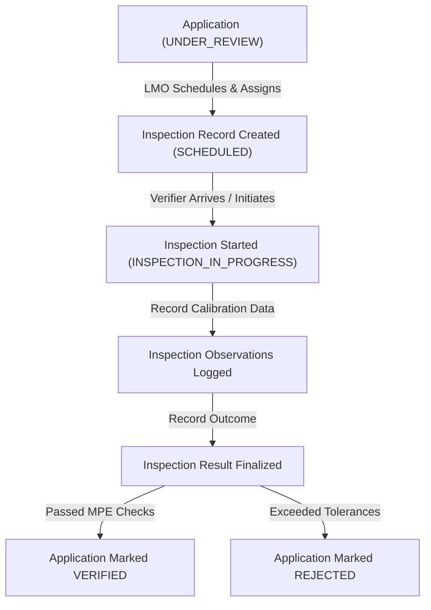

# METRIX — Inspection Workflow & Observation Logging

> **Document Status**: CURRENT STATE (Post-Phase 6 Verified)  
> **Master Index**: See [docs/DOCUMENTATION_INDEX.md](DOCUMENTATION_INDEX.md).

---

## 1. Inspection Operational Lifecycle

The inspection workflow governs the physical and laboratory verification of weighing and measuring instruments:

---

## 2. Scheduling & Single-Verifier Allocation (Option A)

1. **Prerequisite**: Application must be in `UNDER_REVIEW` status.
2. **Scheduling Parameters**: Date (`scheduled_date`), optional time slot (`scheduled_time`), location (`inspection_location`), and remarks.
3. **Single Verifier Assignment**:
   - Every inspection is assigned to exactly one verifier (`assigned_to_id`).
   - Eligible roles:
     - **`LMO`**: For on-site field verifications at retail, commercial, or industrial premises.
     - **`GATC`**: For specialized calibration and laboratory testing at accredited test centres.
   - Only `LMO` or `ADMIN` can schedule or reassign verifiers. Equipment owners cannot assign inspectors.

---

## 3. Digital Inspection Execution & Checklist

### Starting an Inspection
- **Endpoint**: `POST /api/v1/applications/{application_id}/inspection`
- **Effect**: Records `started_at = utc_now()` and advances application to `INSPECTION_IN_PROGRESS`.
- **Authorization**: Must be the assigned verifier (`assigned_to_id`), an LMO, or an Admin.

### Logging Observations
- **Endpoints**:
  - `POST /api/v1/inspections/{inspection_id}/observations`: Adds a parameter measurement.
  - `GET /api/v1/inspections/{inspection_id}/observations`: Retrieves all logged readings.
- **Relational Data Attributes**:
  - `parameter_name`: Standardized test check (e.g., "Zero Load Test", "Repeatability Test", "Eccentricity Test").
  - `observed_value`: Physical reading obtained during inspection (e.g., "50.02 kg").
  - `standard_value`: Reference standard or Maximum Permissible Error (MPE) limit (e.g., "50.00 kg").
  - `unit`: Unit of measurement (e.g., "kg", "g", "L").
  - `is_passed`: Boolean flag indicating statutory compliance.
  - `remarks`: Optional observations regarding seal condition or environment.

---

## 4. Verification Determination & Completion

- **Endpoint**: `PATCH /api/v1/inspections/{inspection_id}/result`
- **Outcomes**:
  - `result = "VERIFIED"`: Advances application to `VERIFIED`. Unlocks digital certificate issuance.
  - `result = "REJECTED"`: Advances application to terminal `REJECTED` state.
- **Side Effects**:
  - Records `completed_at = utc_now()` and `result_remarks`.
  - Automatically dispatches in-app notifications to the applicant and inspector.
  - Appends audit entry into `application_status_histories`.

---

## 5. GATC Scoping & Data Isolation

- Test centres (`GATC`) have access strictly scoped to inspections where `assigned_to_id = current_user.id`.
- Unassigned inspections return `HTTP 404 Not Found` or `HTTP 403 Forbidden`.
- GATC users can record observations and finalize inspection results for their assigned workload, but final statutory certificate issuance remains restricted to `LMO` and `ADMIN`.
