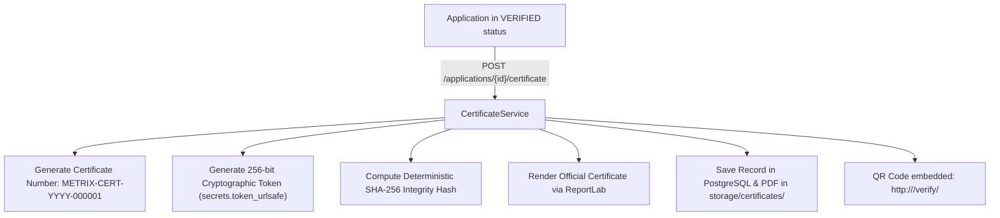

# METRIX — Digital Certificates & QR Verification

> **Document Status**: CURRENT STATE (Post-Phase 6 Verified)  
> **Master Index**: See [docs/DOCUMENTATION_INDEX.md](DOCUMENTATION_INDEX.md).

---

## 1. Digital Certificate Architecture

METRIX issues tamper-evident legal metrology verification certificates for instruments that have successfully passed inspection:



---

## 2. Certificate Issuance & Numbering

- **Endpoint**: `POST /api/v1/applications/{application_id}/certificate`
- **Authorized Roles**: `LMO` and `ADMIN` (GATC cannot issue final certificates).
- **Prerequisite**: Application must be in `VERIFIED` status. Attempting issuance on any other status returns `HTTP 400 Bad Request`.
- **Certificate Number Format**:
  $$\text{METRIX-CERT-}\{\text{YEAR}\}\text{-}\{\text{SEQUENCE}:06\text{d}\}$$
  Example: `METRIX-CERT-2026-000042` (sequential, unique, and indexed).
- **Validity Window**: Default validity is 365 days (`valid_from = today`, `valid_until = today + 365 days`).

---

## 3. Anti-Tamper SHA-256 Integrity Hash

To detect unauthorized database modifications, a deterministic SHA-256 digest is generated from a canonically sorted JSON payload:

```json
{
  "application_number": "APP-20260919-ABCD",
  "certificate_number": "METRIX-CERT-2026-000042",
  "inspection_result": "VERIFIED",
  "instrument_registration_number": "INST-20260919-0012",
  "instrument_serial_number": "SN-998811",
  "instrument_type": "ELECTRONIC_BALANCE",
  "issued_at": "2026-09-19T10:00:00Z",
  "owner_identifier": "Apex Logistics Private Limited",
  "valid_from": "2026-09-19",
  "valid_until": "2027-09-19",
  "verification_token": "u_kX93rLp8..."
}
```

$$\text{integrity\_hash} = \text{SHA-256}(\text{canonical\_payload\_utf8})$$

### Legal Metrology Notice: Digest $\neq$ Digital Signature
> [!IMPORTANT]
> The SHA-256 hash is an **anti-tampering integrity digest** that enables backend detection of unauthorized record alterations. It is **NOT** an asymmetric public-key (PKI) digital signature (e.g., X.509, DSC USB token, or RSA/ECDSA signature). METRIX does not claim PKI digital signature compliance in this baseline.

---

## 4. Unguessable QR Verification Token

- **Entropy Guarantee**: Verification tokens are generated using Python's cryptographically secure pseudo-random number generator:
  ```python
  secrets.token_urlsafe(32)
  ```
  This yields $256$ bits of entropy, rendering brute-force URL guessing mathematically infeasible.
- **Embedded QR Link**: The certificate PDF embeds a QR code resolving to:
  `http://<domain>/verify/<verification_token>`

---

## 5. Public Verification Portal

- **API Endpoint**: `GET /api/v1/public/certificates/verify/{verification_token}`
- **Authentication**: None required (open to citizens, traders, and enforcement officers).
- **Dynamic Validity Calculation**: Inspects `valid_until`. If $\text{current\_date} > \text{valid\_until}$, the returned status dynamically reports `EXPIRED` even if no background scan has run yet.
- **Privacy Safeguards**: Returns technical metrological verification data (instrument type, serial number, make, model, verification date, validity window, result, and integrity hash). Owner personal phone numbers, passwords, and internal officer notes are strictly excluded.

---

## 6. PDF Generation & Local Storage

- Certificates are rendered using the Python **ReportLab** PDF engine.
- Layout includes: Official Government / Legal Metrology header, instrument identification table, verification observation summary, validity dates, authorized officer seal, and the high-contrast scannable QR code.
- Files are saved directly to `backend/storage/certificates/<cert_number>.pdf` and downloaded via `GET /api/v1/certificates/{id}/download`.
