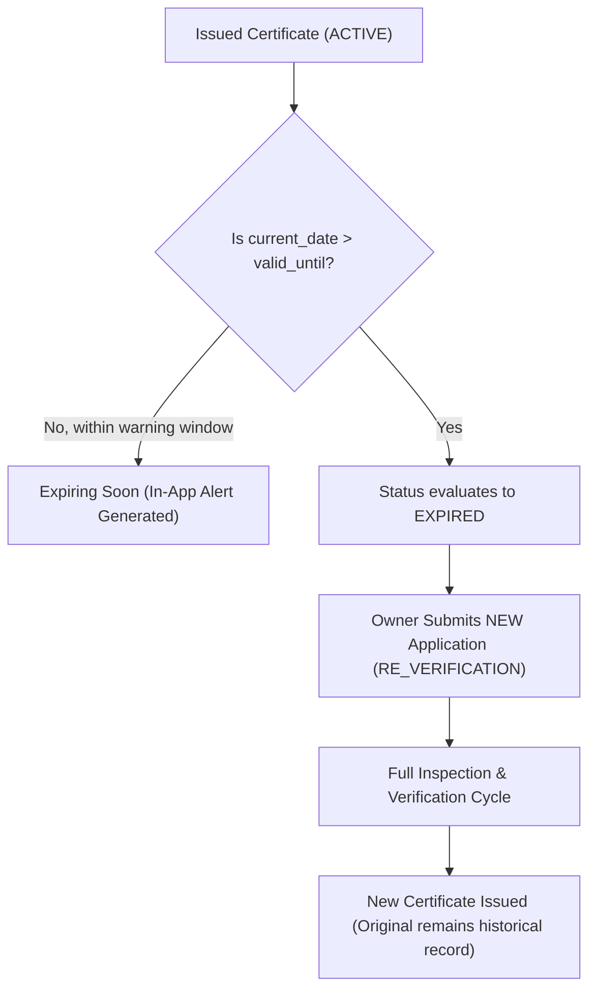

# METRIX — Expiry Tracking & Periodic Re-Verification

> **Document Status**: CURRENT STATE (Post-Phase 6 Verified)  
> **Master Index**: See [docs/DOCUMENTATION_INDEX.md](DOCUMENTATION_INDEX.md).

---

## 1. Statutory Expiry Architecture

In legal metrology, instrument verification certificates are granted for fixed statutory intervals (typically one or two years). METRIX tracks validity deterministically using the database column `valid_until` as the **single source of truth**.



---

## 2. Dynamic vs. Persisted Expiry

1. **Dynamic Evaluation (Read-Time)**:
   - When retrieving certificate details or verifying a public QR token, the service compares `valid_until` against `datetime.date.today()`.
   - If `today > valid_until`, the response reports `status: "EXPIRED"` in real time, guaranteeing consumers and officers never see a stale `ACTIVE` certificate.
2. **Persisted Transition (Batch Scan)**:
   - Evaluated via `POST /api/v1/notifications/check-expiries` or during scheduled maintenance.
   - Updates the database row `certificates.status = CertificateStatus.EXPIRED` and dispatches an in-app alert to the owner.

---

## 3. Warning Threshold & Alerts

- **Configuration**: `CERTIFICATE_EXPIRY_WARNING_DAYS` in `app.core.config.Settings` (default: **30 days**).
- **Expiring Window**:
  $$\text{current\_date} \le \text{valid\_until} \le \text{current\_date} + \text{warning\_days}$$
- **Deduplication**:
  - When a certificate enters the 30-day window, a `CERTIFICATE_EXPIRING` notification is created for the owner.
  - The notification repository checks for an existing notice with `(user_id, entity_type="certificate", entity_id=cert.id, type=CERTIFICATE_EXPIRING)` to prevent spamming owners on repeated scans.

---

## 4. Operational Endpoints for Expiry Tracking

- `GET /api/v1/certificates/expiring`: Paginated list of active certificates expiring within the warning period. Scoped by user ownership.
- `GET /api/v1/certificates/expired`: Paginated list of expired certificates. Scoped by user ownership.
- `GET /api/v1/reports/expiries`: Streams a CSV report containing certificate number, instrument registration, owner details, days remaining, and statutory validity dates.

---

## 5. Non-Destructive Re-Verification Architecture

When an instrument certificate lapses or nears expiration, the owner requests re-verification:

```text
1. Instrument Owner navigates to Instruments dashboard.
2. Clicks "+ New Application", selects the existing instrument, and selects:
   application_type = "RE_VERIFICATION"
3. A new row is inserted in `verification_applications`:
   - id: <new_id>
   - application_number: APP-YYYYMMDD-XXXX
   - instrument_id: <existing_id>
   - application_type: "RE_VERIFICATION"
   - status: "DRAFT"
4. Application follows the standard verification lifecycle:
   SUBMITTED → UNDER_REVIEW → SCHEDULED → INSPECTION → VERIFIED
5. On verification pass, LMO issues a NEW certificate:
   - New certificate_number (e.g. METRIX-CERT-2027-000105)
   - New verification_token and QR code
   - New validity window (valid_from to valid_until)
   - Previous certificate remains in the database with status "EXPIRED"
```

- **Audit Preservation**: Historical inspections, observations, and expired certificates are never overwritten or deleted.
- **Continuous Registry**: The physical `instruments` record remains permanent; its history links to all past applications and certificates.
