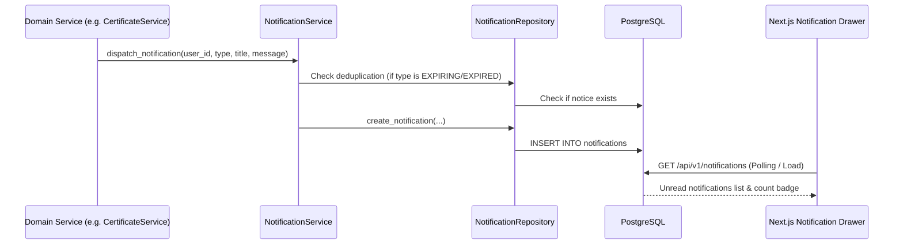

# METRIX — In-App Notifications

> **Document Status**: CURRENT STATE (Post-Phase 6 Verified)  
> **Master Index**: See [docs/DOCUMENTATION_INDEX.md](DOCUMENTATION_INDEX.md).

---

## 1. Notification Architecture

METRIX features an internal, event-driven in-app notification bus persisted directly in PostgreSQL (`notifications` table), eliminating external message brokers (such as RabbitMQ, Kafka, or Redis) while delivering real-time user alerting.



---

## 2. Notification Data Model

The `notifications` table schema:
- `id`: BigInteger primary key.
- `user_id`: Integer foreign key referencing `users.id` (Indexed).
- `type`: Enum `NotificationType` describing the operational event.
- `title`: String(128) notification headline.
- `message`: Text content describing the action and reference IDs.
- `is_read`: Boolean flag (Indexed, default `False`).
- `created_at`: UTC timestamp of event occurrence.
- `read_at`: Nullable UTC timestamp of when marked read by user.
- `entity_type`: Optional string (e.g., `"application"`, `"certificate"`) for deduplication.
- `entity_id`: Optional integer ID for deduplication.

---

## 3. Verified Notification Types & Lifecycle Triggers

METRIX implements nine distinct notification events aligned with statutory state transitions:

| Notification Type | Triggering Event | Target Recipient | Content Description |
| :--- | :--- | :--- | :--- |
| `APPLICATION_SUBMITTED` | Owner submits application | Instrument Owner | Confirms application reference number and receipt |
| `APPLICATION_SCHEDULED` | Officer schedules appointment | Instrument Owner | Informs of date, time slot, and inspection location |
| `INSPECTION_ASSIGNED` | Verifier allocated | Assigned LMO / GATC | Alerts verifier of newly allocated inspection queue |
| `INSPECTION_COMPLETED` | Observations finalized | Owner & Verifier | Confirms field/lab inspection data submitted |
| `APPLICATION_VERIFIED` | Verification approved | Instrument Owner | Informs that instrument passed statutory MPE testing |
| `APPLICATION_REJECTED` | Verification rejected | Instrument Owner | Explains non-compliance reasons and next steps |
| `CERTIFICATE_ISSUED` | Digital certificate created | Instrument Owner | Provides certificate number and validity dates |
| `CERTIFICATE_EXPIRING` | Certificate in warning window | Instrument Owner | Reminds owner to prepare for re-verification |
| `CERTIFICATE_EXPIRED` | Certificate lapses validity | Instrument Owner | Alerts owner that equipment must be re-verified |

---

## 4. Notification API Endpoints

- `GET /api/v1/notifications`: Retrieves paginated notifications for the authenticated user, supporting filtering by `is_read` status.
- `PATCH /api/v1/notifications/{id}/read`: Marks an individual notification as read (`is_read = True`, sets `read_at`).
- `PATCH /api/v1/notifications/read-all`: Bulk-marks all unread notifications as read for the authenticated user.
- `POST /api/v1/notifications/check-expiries`: Administrative endpoint that scans all active certificates, transitions lapsed certificates to `EXPIRED`, and dispatches deduplicated warning alerts.

---

## 5. Deduplication & Anti-Spam Safeguards

To prevent flooding equipment owners with redundant notifications during periodic scans:
- Before inserting a `CERTIFICATE_EXPIRING` notice, the system queries:
  ```sql
  SELECT id FROM notifications 
  WHERE user_id = :user_id 
    AND entity_type = 'certificate' 
    AND entity_id = :cert_id 
    AND type = 'CERTIFICATE_EXPIRING'
  ```
- If an alert of that type already exists for that certificate, notification creation is skipped.
- The same deduplication invariant applies to `CERTIFICATE_EXPIRED` alerts.
