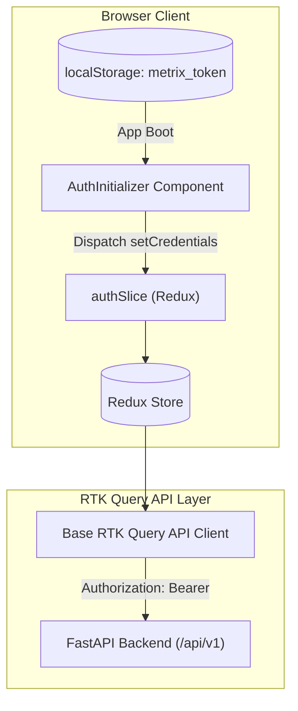

# METRIX — Frontend Architecture & Route Structure

> **Document Status**: CURRENT STATE (Post-Phase 6 Verified)  
> **Master Index**: See [docs/DOCUMENTATION_INDEX.md](DOCUMENTATION_INDEX.md).

---

## 1. Frontend Technology Stack

- **Framework**: Next.js 14 (App Router)
- **Language**: TypeScript (strict type-checking with zero `tsc` errors)
- **Styling**: Tailwind CSS with responsive layout grids
- **State Management**: Redux Toolkit (`@reduxjs/toolkit`, `react-redux`)
- **Server Data Layer**: RTK Query (automated request deduplication, caching, and cache invalidation)
- **Iconography**: Lucide React icons

---

## 2. Compiled Application Routes

During the Phase 6 production build (`npm run build`), Next.js successfully compiled all application routes:

| Route Path | Rendering Mode | Purpose & Target Actors |
| :--- | :--- | :--- |
| `/` | Static (○) | Public landing page presenting system overview and statutory features |
| `/_not-found` | Static (○) | User-friendly 404 error page |
| `/login` | Static (○) | Dual authentication portal (Sign In and Account Registration) |
| `/dashboard` | Static (○) | Role-adaptive dashboard rendering operational metrics for Owner/LMO/GATC/Admin |
| `/applications` | Static (○) | Application workbench: lists verification requests with status filters |
| `/applications/[id]`| Dynamic (ƒ) | Comprehensive application dossier: timeline, inspection details, observations |
| `/notifications`| Static (○) | In-app notification center with read/unread filtering and mark-all-read |
| `/search` | Static (○) | Global multi-domain search across instruments, applications, and certificates |
| `/reports` | Static (○) | Operational reports center supporting role-scoped CSV downloads |
| `/verify/[token]` | Dynamic (ƒ) | Public zero-login certificate verification portal with live QR validation |

---

## 3. State Management & Session Lifecycle

- **`AuthInitializer`**: Mounted at the root layout. Reads saved tokens from local storage on browser startup/refresh, verifies user session via `/auth/me`, and hydrates the Redux store without flicker.
- **`authSlice`**: Stores the current user object, assigned role, and JWT access token. Provides typed selectors (`selectCurrentUser`, `selectIsAuthenticated`).

---

## 4. Feature Modals & Interactive Workflows

To prevent cluttered pages and preserve strict file line limits (≤ 300 lines per component), interactive actions are decomposed into modular feature dialogs:

1. **`RegisterInstrumentModal`**: Owner form for registering a new instrument (make, model, serial number, location, capacity).
2. **`CreateApplicationModal`**: Guided dialog allowing owners to select a registered instrument and submit an initial or re-verification application.
3. **`ScheduleModal`**: Officer modal for setting inspection date, time slot, and location.
4. **`AssignModal`**: Officer/Admin dialog for allocating an LMO or GATC verifier.
5. **`AddObservationModal`**: Digital checklist modal for entering test parameter readings during an active inspection.
6. **`InspectionResultModal`**: Officer modal for finalizing verification outcome (`VERIFIED` or `REJECTED`).
7. **`IssueCertificateModal`**: Official certificate issuance modal generating PDF credentials.

---

## 5. Frontend Quality Standards & Line Limits

- **Modularity**: All TSX components adhere to the project guideline of **≤ 300 lines per file**.
- **Responsive Design**: Interfaces adapt cleanly to mobile, tablet, and desktop viewports.
- **Type Safety**: Strictly typed interfaces defined in `frontend/src/types/index.ts`. No untyped `any` workarounds.
