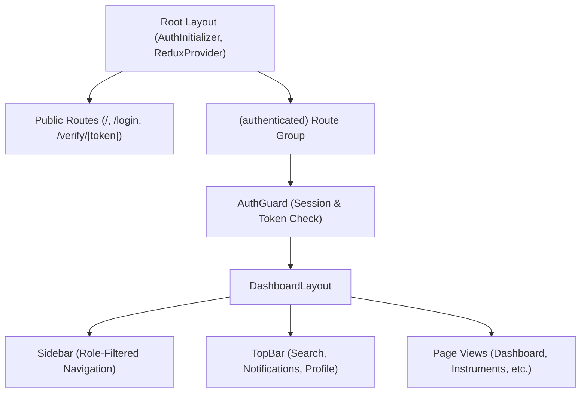

# METRIX — Frontend Architecture & Route Structure

> **Document Status**: CURRENT STATE (Production-Ready 16-Route Architecture)  
> **Master Index**: See [docs/DOCUMENTATION_INDEX.md](DOCUMENTATION_INDEX.md).

---

## 1. Frontend Technology Stack

- **Framework**: Next.js 14 (App Router)
- **Language**: TypeScript (strict type-checking with zero `tsc` errors)
- **Styling**: Vanilla Tailwind CSS with clean, professional light theme palette
- **Color Palette**: Emerald (`#059669` primary), Slate (`#0F172A` text/slate-900, `#F8FAFC` background), White
- **State Management**: Redux Toolkit (`@reduxjs/toolkit`, `react-redux`)
- **Server Data Layer**: RTK Query (automated caching, polling, deduplication, cache tags)
- **Iconography**: Lucide React icons

---

## 2. Compiled Application Routes (16 Routes)

All routes are compiled, type-checked, and statically/dynamically generated via `npm run build`:

| Route Path | Rendering Mode | Access Scope | Purpose & Key Features |
| :--- | :--- | :--- | :--- |
| `/` | Static (○) | Public | Hero banner, 6-stage lifecycle explainer, direct QR lookup |
| `/_not-found` | Static (○) | Public | Standard 404 recovery page |
| `/login` | Static (○) | Public | Sign In/Registration with instant demo role account switcher |
| `/verify/[token]` | Dynamic (ƒ) | Public | QR code certificate verification with SHA-256 integrity hash |
| `/dashboard` | Static (○) | Authenticated | Dynamic role telemetry for Owner, LMO, GATC, and Admin |
| `/instruments` | Static (○) | Authenticated | Equipment inventory, search, category filter, registration modal |
| `/instruments/[id]` | Dynamic (ƒ) | Authenticated | Instrument dossier, verification history, edit & deactivation |
| `/applications` | Static (○) | Authenticated | Verification application workbench with status filtering |
| `/applications/[id]`| Dynamic (ƒ) | Authenticated | Complete verification state machine controls & draft deletion |
| `/certificates` | Static (○) | Authenticated | Digital certificate registry with active/expiring/expired tabs |
| `/certificates/[id]`| Dynamic (ƒ) | Authenticated | QR certificate preview, anti-tamper hash, ReportLab PDF download |
| `/inspections` | Static (○) | LMO, GATC, Admin | Operational queue of assigned verifications and test deep-links |
| `/profile` | Static (○) | Authenticated | Account details, contact editing, and secure password change |
| `/admin/users` | Static (○) | Admin | User management, role filtering, active toggling, official provisioning |
| `/admin/system` | Static (○) | Admin | Platform telemetry, database connection stats, audit & error stream |
| `/reports` | Static (○) | Authenticated | Streaming regulatory CSV reports for instruments, apps, certificates |
| `/search` | Static (○) | Authenticated | Cross-entity search across instruments, applications, certificates |
| `/notifications` | Static (○) | Authenticated | In-app notification hub with read/unread filters & mark-all-read |

---

## 3. Layout Shell & Authentication Guard

The application utilizes a route group `src/app/(authenticated)/` with a unified layout shell:

- **`AuthGuard.tsx`**: Intercepts unauthenticated navigation, preserves attempted destination, and redirects to `/login`.
- **`Sidebar.tsx`**: Role-adaptive navigation menu configured in `utils/roleConfig.ts`. Automatically hides administrative options from instrument owners.
- **`TopBar.tsx`**: Displays current route breadcrumbs, quick global search shortcut, notification bell with periodic unread badge count, and user profile drawer.

---

## 4. Reusable UI Primitives (`src/components/ui/`)

To ensure design consistency across all pages and enforce file size limits:
1. **`StatusBadge.tsx`**: Consistent color-coded badges for Application, Instrument, and Certificate states.
2. **`MetricCard.tsx`**: Standard card for KPI numbers, percentage changes, and contextual icons.
3. **`DataTable.tsx`**: Generic, typed table component with empty states, loading skeletons, and pagination.
4. **`EmptyState.tsx`**: Standard empty result visual with actionable CTA button.
5. **`PageHeader.tsx`**: Standardized page title, descriptive subtitle, and primary action button.
6. **`Modal.tsx`**: Accessible dialog overlay with header, body, and action footer.
7. **`LoadingSpinner.tsx`**: SVG loading spinner in multiple sizes and theme colors.

---

## 5. Feature Modals & Interactive Workflows

Action dialogs are decoupled into separate components (≤ 300 lines each):
- **`RegisterInstrumentModal`**: Instrument specification entry form.
- **`CreateApplicationModal`**: Guided flow for initial/re-verification filing.
- **`ScheduleModal`**: Inspection appointment booking.
- **`AssignModal`**: Allocates LMO officer or GATC centre verifier.
- **`AddObservationModal`**: In-field/lab test readings entry.
- **`InspectionResultModal`**: Officer determination (`VERIFIED`/`REJECTED`).
- **`IssueCertificateModal`**: Final digital certificate generation.
- **`EditProfileModal`**: User self-service profile editor.
- **`ChangePasswordModal`**: Secure password update with current credential check.

---

## 6. Frontend Quality Standards

- **Strict File Limit Compliance**: All TSX/TS files are strictly **≤ 300 lines**.
- **Type Safety**: Strictly typed interfaces in `types/index.ts` with zero compiler warnings.
- **Zero Forbidden Tech**: Pure Next.js, Redux Toolkit, Tailwind CSS. No external cloud brokers.
