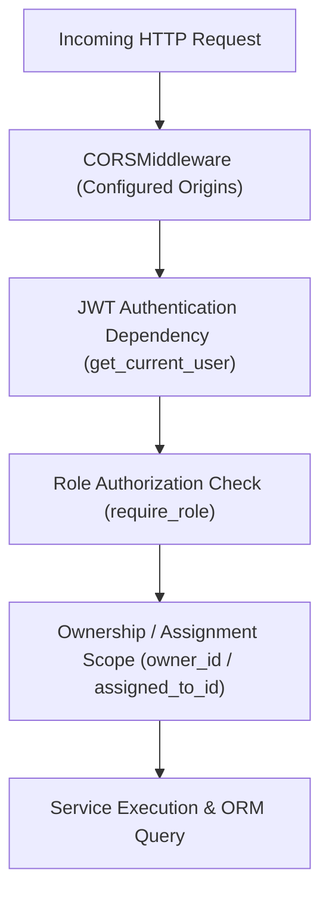

# METRIX — Security & Data Isolation Architecture

> **Document Status**: CURRENT STATE (Post-Phase 6 Verified)  
> **Master Index**: See [docs/DOCUMENTATION_INDEX.md](DOCUMENTATION_INDEX.md).

---

## 1. Security Architecture Principles

METRIX enforces enterprise-grade security within a software-only modular monolith, defending user credentials, statutory audit trails, and sensitive commercial data without requiring third-party cloud security appliances.

---

## 2. Authentication & Cryptographic Controls

1. **Password Hashing**:
   - User passwords are automatically salted and hashed using `bcrypt` via Passlib. Plaintext passwords are never stored, logged, or serialized into API responses.
2. **Stateless JWT Tokens**:
   - Authentication tokens are signed with HMAC-SHA256 (`HS256`) using `settings.SECRET_KEY`.
   - Token validity is capped at 24 hours (`ACCESS_TOKEN_EXPIRE_MINUTES = 1440`).
3. **Zero Hardcoded Secrets**:
   - Secret keys, database credentials, and token parameters are loaded strictly from environment variables via `pydantic-settings`. No production secrets exist in version control.

---

## 3. Role-Based Ownership & Data Isolation

METRIX enforces strict data boundaries within a shared relational database:

1. **Instrument Owner Isolation**:
   - In all queries on instruments, applications, and certificates, the service layer filters by `owner_id = current_user.id`.
   - Attempts to access unowned assets via ID manipulation return `HTTP 404 Not Found` or `HTTP 403 Forbidden`, mitigating Insecure Direct Object Reference (IDOR) vulnerabilities.
2. **GATC Test Centre Scoping**:
   - Government Approved Test Centres have access restricted strictly to verifications and inspections where `assigned_to_id = current_user.id`.
   - GATCs cannot view unrelated commercial records or competitive laboratory data.
3. **Public Endpoint Data Minimization**:
   - The public verification route (`/api/v1/public/certificates/verify/{token}`) exposes only technical calibration data.
   - Private owner contact details, trade license numbers, and internal officer remarks are excluded from the public Pydantic response schema.

---

## 4. Threat Model Analysis (STRIDE)

| Threat Category | Potential Attack Vector | Implemented METRIX Defense |
| :--- | :--- | :--- |
| **Spoofing** | Forged user identity or credential stuffing | Salted `bcrypt` hashing, HS256 JWT signature verification, and secure password requirements. |
| **Tampering** | Modifying certificate records or inspection results | Deterministic SHA-256 certificate hashing and immutable append-only `application_status_histories`. |
| **Repudiation** | Officer or owner denying verification actions | Every state change records user ID, timestamp, and action in unmodifiable relational tables. |
| **Information Disclosure** | Cross-tenant data leakage or exposed endpoints | Scoped ORM queries (`owner_id`/`assigned_to_id`), Pydantic response filtering, public data minimization. |
| **Denial of Service** | Resource exhaustion via large payloads | Strict Pydantic string limits, regex validation, and mandatory database pagination limits. |
| **Elevation of Privilege** | Normal user calling administrative endpoints | Declarative FastAPI dependencies (`require_role(UserRole.LMO, UserRole.ADMIN)`) at router boundary. |

---

## 5. Certificate Integrity Verification

- When a certificate is issued, an anti-tampering SHA-256 digest is calculated over a sorted JSON representation of core attributes.
- If a record is manually modified in the database (e.g. altering `valid_until` to extend an expired permit), the recalculated hash fails to match `integrity_hash`, instantly flagging the certificate as tampered.
