# METRIX — Comprehensive System Diagrams & Architecture Specification

> **Project**: METRIX — Online Verification and Digital Certification System for Weighing and Measuring Instruments  
> **Problem Statement**: Smart India Hackathon (SIH 2026) — Problem Statement **SIH26036**  
> **Document Status**: Production-Ready Architectural Reference  
> **Related Documents**: [System Architecture](02-system-architecture.md) | [Domain Model](03-domain-model.md) | [Database Architecture](04-database.md) | [Verification Workflow](06-verification-workflow.md)

---

## Table of Contents
1. [1. UML Use Case Diagram](#1-uml-use-case-diagram)
   - [1.1 Actor Definitions](#11-actor-definitions)
   - [1.2 Use Case Diagram (Visual Model)](#12-use-case-diagram-visual-model)
   - [1.3 Actor to Use Case Mapping Matrix](#13-actor-to-use-case-mapping-matrix)
2. [2. Entity-Relationship (ER) Diagram](#2-entity-relationship-er-diagram)
   - [2.1 Visual ER Diagram](#21-visual-er-diagram)
   - [2.2 Relational Integrity & Key Constraints](#22-relational-integrity--key-constraints)
3. [3. Process Flow Charts](#3-process-flow-charts)
   - [3.1 End-to-End Operational Lifecycle Flowchart](#31-end-to-end-operational-lifecycle-flowchart)
   - [3.2 Inspection & MPE Tolerance Validation Sub-Process](#32-inspection--mpe-tolerance-validation-sub-process)
   - [3.3 QR Code Scanning & Public Verification Flowchart](#33-qr-code-scanning--public-verification-flowchart)
4. [4. UML Diagrams](#4-uml-diagrams)
   - [4.1 UML Class Diagram](#41-uml-class-diagram)
   - [4.2 UML Sequence Diagrams](#42-uml-sequence-diagrams)
     - [Sequence A: Application Lodgement & Verifier Allocation](#sequence-a-application-lodgement--verifier-allocation)
     - [Sequence B: Field Inspection & Observation Logging](#sequence-b-field-inspection--observation-logging)
     - [Sequence C: Certificate Issuance, SHA-256 Digest & QR Embedding](#sequence-c-certificate-issuance-sha-256-digest--qr-embedding)
     - [Sequence D: Zero-Login Public QR Code Verification](#sequence-d-zero-login-public-qr-code-verification)
   - [4.3 UML State Machine Diagram (Lifecycle Statecharts)](#43-uml-state-machine-diagram-lifecycle-statecharts)
   - [4.4 UML Component & Package Architecture Diagram](#44-uml-component--package-architecture-diagram)

---

## 1. UML Use Case Diagram

The METRIX platform serves five human actor roles and automated background services to automate the statutory verification lifecycle under the Legal Metrology Act.

### 1.1 Actor Definitions

| Actor | Type | Description |
| :--- | :--- | :--- |
| **Instrument Owner / Business** | Primary Human | Traders, retail businesses, transport hubs, and manufacturing plants registering measuring instruments and submitting verification requests. |
| **Legal Metrology Officer (LMO)** | Primary Human | Statutory government enforcement officers reviewing applications, conducting field verifications, evaluating Maximum Permissible Error (MPE), and issuing official digital certificates. |
| **Government Approved Test Centre (GATC)** | Primary Human | Accredited calibration laboratories assigned to conduct specialized laboratory testing and log precision observations. |
| **System Administrator** | Primary Human | Oversees district officer accounts, inspects audit logs, manages system configurations, and monitors state-wide compliance. |
| **Public Consumer / Citizen** | Primary Human | Citizens, consumers, or commercial partners scanning instrument QR codes to confirm metrological validity without authentication. |
| **Automated System Daemon / Scheduler** | Secondary System | Background cron jobs monitoring certificate validity deadlines, updating dynamic expiry statuses, and triggering reminder alerts. |

---

### 1.2 Use Case Diagram (Visual Model)

```mermaid
flowchart LR
    %% Actors
    subgraph Actors ["System Actors"]
        direction TB
        Owner["👤 Instrument Owner"]
        LMO["👤 Legal Metrology Officer (LMO)"]
        GATC["👤 Test Centre (GATC)"]
        Admin["👤 Administrator"]
        Public["👤 Public / Citizen"]
        System["⚙️ System Scheduler"]
    end

    %% System Boundary
    subgraph METRIX ["METRIX System Boundary"]
        direction TB

        subgraph ModAuth ["Authentication & Profiles"]
            UC_Reg(["Register Account"])
            UC_Login(["Login (JWT / Google Auth)"])
            UC_Profile(["Manage Stakeholder Profile"])
        end

        subgraph ModInst ["Instrument Fleet Management"]
            UC_RegInst(["Register Measuring Instrument"])
            UC_BulkInst(["Bulk Upload Instruments (CSV)"])
            UC_ViewInst(["View Registered Fleet"])
        end

        subgraph ModApp ["Verification Applications"]
            UC_DraftApp(["Draft Verification Application"])
            UC_SubmitApp(["Submit Application (Initial/Re-Verif)"])
            UC_TrackApp(["Track Application & Audit History"])
        end

        subgraph ModReview ["Review & Scheduling"]
            UC_ReviewApp(["Review Submitted Application"])
            UC_Schedule(["Schedule Inspection & Slot"])
            UC_Assign(["Assign Verifier (LMO / GATC)"])
            UC_RejectApp(["Reject Application with Remarks"])
        end

        subgraph ModInspect ["Inspection & Observation"]
            UC_StartInspect(["Initiate Inspection Execution"])
            UC_LogObs(["Record Test Observations (MPE)"])
            UC_UploadGeo(["Upload Inspection Photos"])
            UC_FinalizeInspect(["Record Result (Verified / Rejected)"])
        end

        subgraph ModCert ["Certificate & QR Engine"]
            UC_IssueCert(["Issue Digital Certificate"])
            UC_GenHash(["Compute SHA-256 Integrity Hash"])
            UC_GenQR(["Generate 256-bit QR Token"])
            UC_RenderPDF(["Render Official PDF via ReportLab"])
            UC_DownloadPDF(["Download / Print Certificate"])
        end

        subgraph ModPublic ["Public Verification Portal"]
            UC_ScanQR(["Scan Physical Instrument QR Code"])
            UC_VerifyToken(["Validate Token & View Status"])
        end

        subgraph ModAdmin ["Governance & Operations"]
            UC_ManageUsers(["Manage Officers & GATCs"])
            UC_Telemetry(["View Analytics & Telemetry"])
            UC_ExportCSV(["Export Regulatory CSV Reports"])
            UC_Notices(["Publish Official Circulars"])
            UC_CheckExpiry(["Monitor & Notify Expiring Certs"])
        end
    end

    %% Actor to Use Case Connections
    Owner --> UC_Reg
    Owner --> UC_Login
    Owner --> UC_Profile
    Owner --> UC_RegInst
    Owner --> UC_BulkInst
    Owner --> UC_ViewInst
    Owner --> UC_DraftApp
    Owner --> UC_SubmitApp
    Owner --> UC_TrackApp
    Owner --> UC_DownloadPDF

    LMO --> UC_Login
    LMO --> UC_ReviewApp
    LMO --> UC_Schedule
    LMO --> UC_Assign
    LMO --> UC_RejectApp
    LMO --> UC_StartInspect
    LMO --> UC_LogObs
    LMO --> UC_UploadGeo
    LMO --> UC_FinalizeInspect
    LMO --> UC_IssueCert
    LMO --> UC_DownloadPDF
    LMO --> UC_Telemetry

    GATC --> UC_Login
    GATC --> UC_StartInspect
    GATC --> UC_LogObs
    GATC --> UC_UploadGeo
    GATC --> UC_FinalizeInspect

    Admin --> UC_Login
    Admin --> UC_ManageUsers
    Admin --> UC_ReviewApp
    Admin --> UC_Schedule
    Admin --> UC_Assign
    Admin --> UC_IssueCert
    Admin --> UC_Telemetry
    Admin --> UC_ExportCSV
    Admin --> UC_Notices

    Public --> UC_ScanQR
    Public --> UC_VerifyToken

    System --> UC_CheckExpiry

    %% Includes and Extends
    UC_IssueCert -.->|"<<include>>"| UC_GenHash
    UC_IssueCert -.->|"<<include>>"| UC_GenQR
    UC_IssueCert -.->|"<<include>>"| UC_RenderPDF
    UC_SubmitApp -.->|"<<include>>"| UC_TrackApp
    UC_FinalizeInspect -.->|"<<include>>"| UC_LogObs
    UC_RejectApp -.->|"<<extend>>"| UC_ReviewApp
    UC_ScanQR -.->|"<<include>>"| UC_VerifyToken
```

---

### 1.3 Actor to Use Case Mapping Matrix

| Functional Module | Use Case Name | Owner | LMO | GATC | Admin | Public |
| :--- | :--- | :---: | :---: | :---: | :---: | :---: |
| **Auth & Profile** | Register Account & Verify OTP | Yes | — | — | — | — |
| | Login (JWT / Google OAuth) | Yes | Yes | Yes | Yes | — |
| | Manage Business Profile & Licences | Yes | — | — | — | — |
| **Instrument Registry**| Register Commercial Instrument | Yes | — | — | Yes | — |
| | Bulk Import via CSV | Yes | — | — | Yes | — |
| | View Registered Fleet & Due Dates | Yes | Yes | — | Yes | — |
| **Applications** | Draft & Submit Initial Verification | Yes | — | — | — | — |
| | Submit Periodic Re-Verification | Yes | — | — | — | — |
| | Track Application Status Timeline | Yes | Yes | Yes | Yes | — |
| **Scheduling** | Review Application Completeness | — | Yes | — | Yes | — |
| | Reject Ineligible Application | — | Yes | — | Yes | — |
| | Schedule Date & Allocate Verifier | — | Yes | — | Yes | — |
| **Inspection** | Execute Physical/Lab Testing | — | Yes | Yes | Yes | — |
| | Record Tolerances (MPE Observations) | — | Yes | Yes | Yes | — |
| | Upload Geotagged Instrument Evidence | — | Yes | Yes | Yes | — |
| | Finalize Verification Outcome | — | Yes | Yes | Yes | — |
| **Certification** | Generate Tamper-Proof Certificate | — | Yes | — | Yes | — |
| | Render Official PDF with ReportLab | — | Yes | — | Yes | — |
| | Download Statutory Digital Certificate| Yes | Yes | Yes | Yes | — |
| **Public Portal** | Scan Physical Instrument QR Code | Yes | Yes | Yes | Yes | Yes |
| | Query Cryptographic Verification Token| — | — | — | — | Yes |
| **Operations** | Export Regulatory Compliance CSVs | — | — | — | Yes | — |
| | Publish Portal Notices & Circulars | — | — | — | Yes | — |
| | Manage Officers & GATC Allocations | — | — | — | Yes | — |

---

## 2. Entity-Relationship (ER) Diagram

The persistence layer is modeled in PostgreSQL 14+ using SQLAlchemy 2.x ORM across 10 tables.

### 2.1 Visual ER Diagram

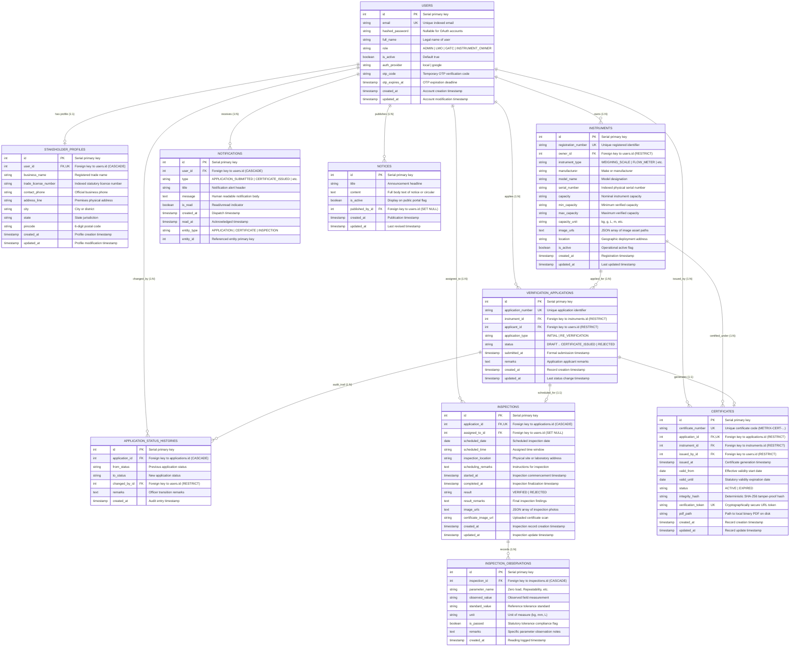

---

### 2.2 Relational Integrity & Key Constraints

1. **Non-Repudiation Constraints (`ondelete="RESTRICT"`)**:
   - `instruments` referenced by `verification_applications` or `certificates` cannot be deleted.
   - `users` who submitted applications or issued certificates cannot be dropped while audit logs depend on them.
2. **Cascading Child Records (`ondelete="CASCADE"`)**:
   - Deleting an `inspection` purges its associated child `inspection_observations`.
   - Deleting a `user` removes their `stakeholder_profiles` and in-app `notifications`.
3. **Decoupled 1:1 Identity Invariants**:
   - An application has at most one `Inspection` and one `Certificate`.
   - Each `Certificate` maintains a distinct 256-bit unguessable `verification_token` with a unique database index.

---

## 3. Process Flow Charts

### 3.1 End-to-End Operational Lifecycle Flowchart

The operational flowchart illustrates the complete lifecycle across actors, from instrument onboarding to public verification and re-verification.

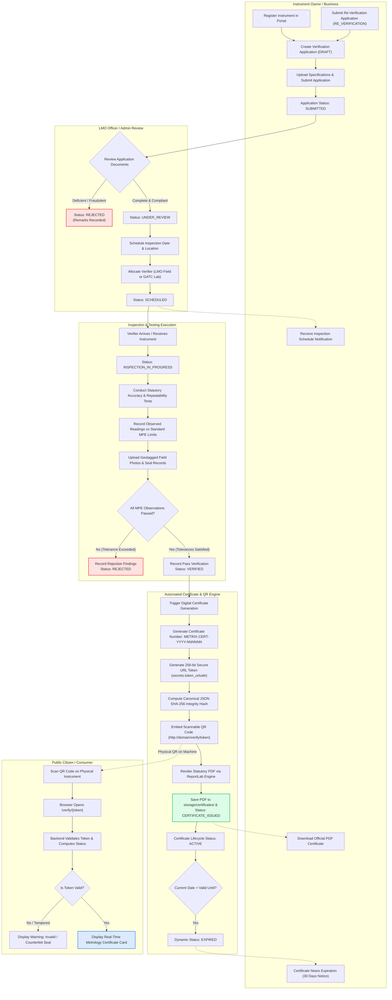

---

### 3.2 Inspection & MPE Tolerance Validation Sub-Process

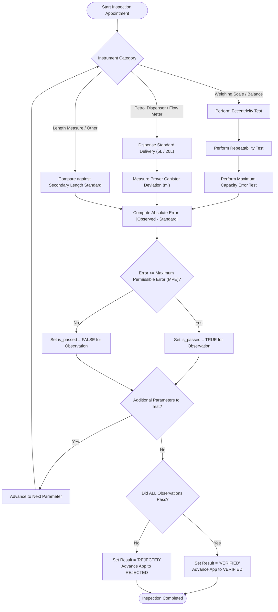

---

### 3.3 QR Code Scanning & Public Verification Flowchart

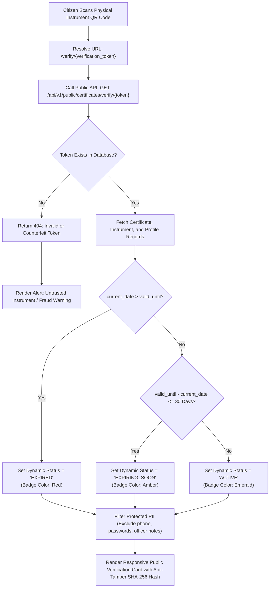

---

## 4. UML Diagrams

### 4.1 UML Class Diagram

The UML Class Diagram depicts the domain models, enumerations, and service orchestrators comprising the backend modular monolith.

```mermaid
classDiagram
    %% Enumerations
    class UserRole {
        <<enumeration>>
        ADMIN
        LMO
        GATC
        INSTRUMENT_OWNER
    }

    class ApplicationStatus {
        <<enumeration>>
        DRAFT
        SUBMITTED
        UNDER_REVIEW
        SCHEDULED
        INSPECTION_IN_PROGRESS
        INSPECTION_COMPLETED
        VERIFIED
        CERTIFICATE_ISSUED
        REJECTED
    }

    class InspectionResult {
        <<enumeration>>
        VERIFIED
        REJECTED
    }

    class InstrumentType {
        <<enumeration>>
        WEIGHING_SCALE
        ELECTRONIC_BALANCE
        PETROL_DISPENSER
        FLOW_METER
        LENGTH_MEASURE
        OTHER
    }

    class CertificateStatus {
        <<enumeration>>
        ACTIVE
        EXPIRED
    }

    %% Domain Entities
    class User {
        +int id
        +string email
        +string hashed_password
        +string full_name
        +UserRole role
        +bool is_active
        +string auth_provider
        +datetime created_at
        +datetime updated_at
        +check_password(raw_password) bool
    }

    class StakeholderProfile {
        +int id
        +int user_id
        +string business_name
        +string trade_license_number
        +string contact_phone
        +string address_line
        +string city
        +string state
        +string pincode
    }

    class Instrument {
        +int id
        +string registration_number
        +int owner_id
        +InstrumentType instrument_type
        +string manufacturer
        +string model_name
        +string serial_number
        +string capacity
        +string min_capacity
        +string max_capacity
        +string capacity_unit
        +string location
        +bool is_active
    }

    class VerificationApplication {
        +int id
        +string application_number
        +int instrument_id
        +int applicant_id
        +string application_type
        +ApplicationStatus status
        +datetime submitted_at
        +string remarks
    }

    class ApplicationStatusHistory {
        +int id
        +int application_id
        +ApplicationStatus from_status
        +ApplicationStatus to_status
        +int changed_by_id
        +string remarks
        +datetime created_at
    }

    class Inspection {
        +int id
        +int application_id
        +int assigned_to_id
        +date scheduled_date
        +string scheduled_time
        +string inspection_location
        +datetime started_at
        +datetime completed_at
        +InspectionResult result
        +string result_remarks
        +string certificate_image_url
    }

    class InspectionObservation {
        +int id
        +int inspection_id
        +string parameter_name
        +string observed_value
        +string standard_value
        +string unit
        +bool is_passed
        +string remarks
        +datetime created_at
    }

    class Certificate {
        +int id
        +string certificate_number
        +int application_id
        +int instrument_id
        +int issued_by_id
        +datetime issued_at
        +date valid_from
        +date valid_until
        +CertificateStatus status
        +string integrity_hash
        +string verification_token
        +string pdf_path
        +is_valid_on(check_date) bool
    }

    class Notification {
        +int id
        +int user_id
        +string type
        +string title
        +string message
        +bool is_read
        +datetime created_at
    }

    %% Service Orchestrators
    class AuthService {
        +authenticate_user(email, password) User
        +register_user(schema) User
        +create_access_token(user) string
    }

    class ApplicationService {
        +create_application(user, schema) VerificationApplication
        +transition_status(app_id, new_status, user) VerificationApplication
        +schedule_inspection(app_id, schedule_data, user) Inspection
        +assign_verifier(app_id, verifier_id, user) Inspection
    }

    class InspectionService {
        +start_inspection(app_id, user) Inspection
        +record_result(inspection_id, result_data, user) Inspection
    }

    class ObservationService {
        +add_observation(inspection_id, obs_data, user) InspectionObservation
        +get_observations(inspection_id) List
    }

    class CertificateService {
        +issue_certificate(app_id, user) Certificate
        +verify_public_token(token) PublicCertificate
        +download_certificate_pdf(cert_id, user) FileResponse
    }

    class CertificateHasher {
        +compute_hash(canonical_payload) string
        +verify_hash(cert, expected_hash) bool
    }

    class PdfService {
        +generate_certificate_pdf(cert_data, qr_image_bytes) bytes
    }

    %% Relationships
    User "1" -- "0..1" StakeholderProfile : profile
    User "1" -- "*" Instrument : instruments
    User "1" -- "*" VerificationApplication : applications
    User "1" -- "*" Inspection : assigned_inspections
    User "1" -- "*" Certificate : issued_certificates
    User "1" -- "*" Notification : notifications

    Instrument "1" -- "*" VerificationApplication : applications
    Instrument "1" -- "*" Certificate : certificates

    VerificationApplication "1" -- "*" ApplicationStatusHistory : status_history
    VerificationApplication "1" -- "0..1" Inspection : inspection
    VerificationApplication "1" -- "0..1" Certificate : certificate

    Inspection "1" -- "*" InspectionObservation : observations

    ApplicationService ..> VerificationApplication : manages
    InspectionService ..> Inspection : executes
    ObservationService ..> InspectionObservation : logs
    CertificateService ..> Certificate : creates
    CertificateService ..> CertificateHasher : verifies
    CertificateService ..> PdfService : delegates
```

---

### 4.2 UML Sequence Diagrams

#### Sequence A: Application Lodgement & Verifier Allocation

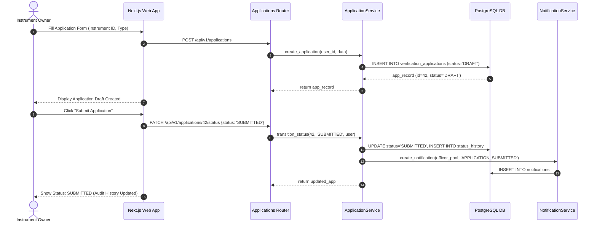

---

#### Sequence B: Field Inspection & Observation Logging

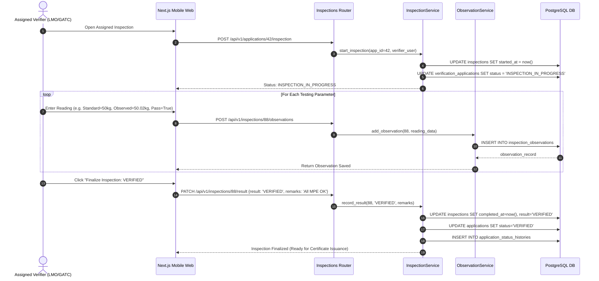

---

#### Sequence C: Certificate Issuance, SHA-256 Digest & QR Embedding

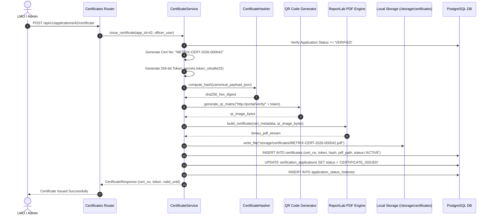

---

#### Sequence D: Zero-Login Public QR Code Verification

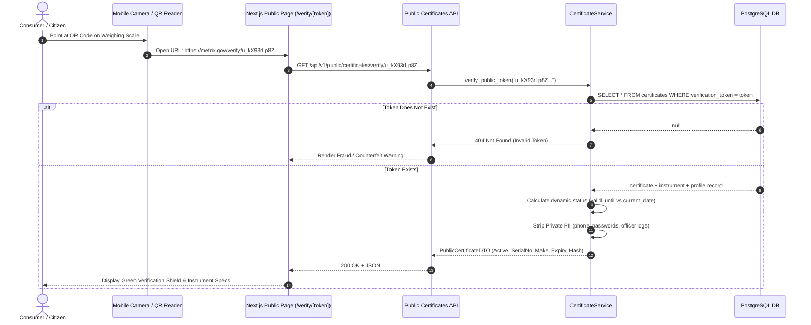

---

### 4.3 UML State Machine Diagram (Lifecycle Statecharts)

A core invariant of METRIX is the strict separation between the **Transactional Application Lifecycle** and the **Temporal Certificate Lifecycle**.

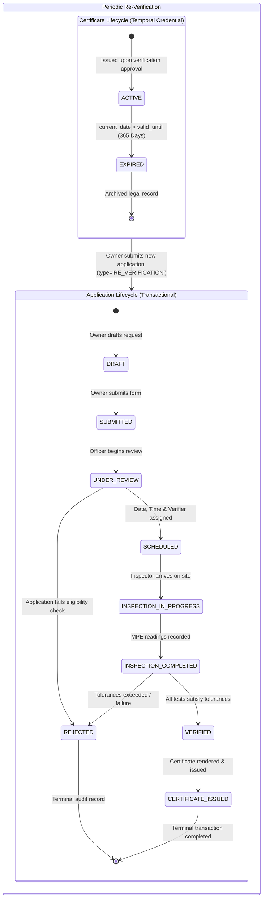

#### State Transition Constraints Table

| From Status | Permitted To Status | Authorized Actor | Pre-Conditions & Constraints |
| :--- | :--- | :--- | :--- |
| `DRAFT` | `SUBMITTED` | Instrument Owner | Instrument profile complete; sets `submitted_at`. |
| `SUBMITTED` | `UNDER_REVIEW` | LMO, Admin | Locks application against owner modification. |
| `UNDER_REVIEW` | `SCHEDULED` | LMO, Admin | Requires valid `scheduled_date` and `assigned_to_id`. |
| `UNDER_REVIEW` | `REJECTED` | LMO, Admin | Requires mandatory rejection reason in `remarks`. |
| `SCHEDULED` | `INSPECTION_IN_PROGRESS` | Assigned Verifier, Admin | Verifier begins test; sets `started_at = now()`. |
| `INSPECTION_IN_PROGRESS` | `INSPECTION_COMPLETED` | Assigned Verifier, Admin | Requires at least one logged parameter observation. |
| `INSPECTION_COMPLETED` | `VERIFIED` | Assigned Verifier, Admin | All observations must have `is_passed = True`. |
| `INSPECTION_COMPLETED` | `REJECTED` | Assigned Verifier, Admin | One or more observations failed MPE tolerances. |
| `VERIFIED` | `CERTIFICATE_ISSUED` | LMO, Admin | Triggers SHA-256 hash, QR generation, ReportLab PDF. |
| `CERTIFICATE_ISSUED` | *(Terminal)* | None | Immutable state; no further transitions allowed. |
| `REJECTED` | *(Terminal)* | None | Immutable state; audit log permanently preserved. |

---

### 4.4 UML Component & Package Architecture Diagram

The system adheres to a software-only **Modular Monolith** pattern with explicit separation of presentation, routing, domain services, persistence, and asset generation.

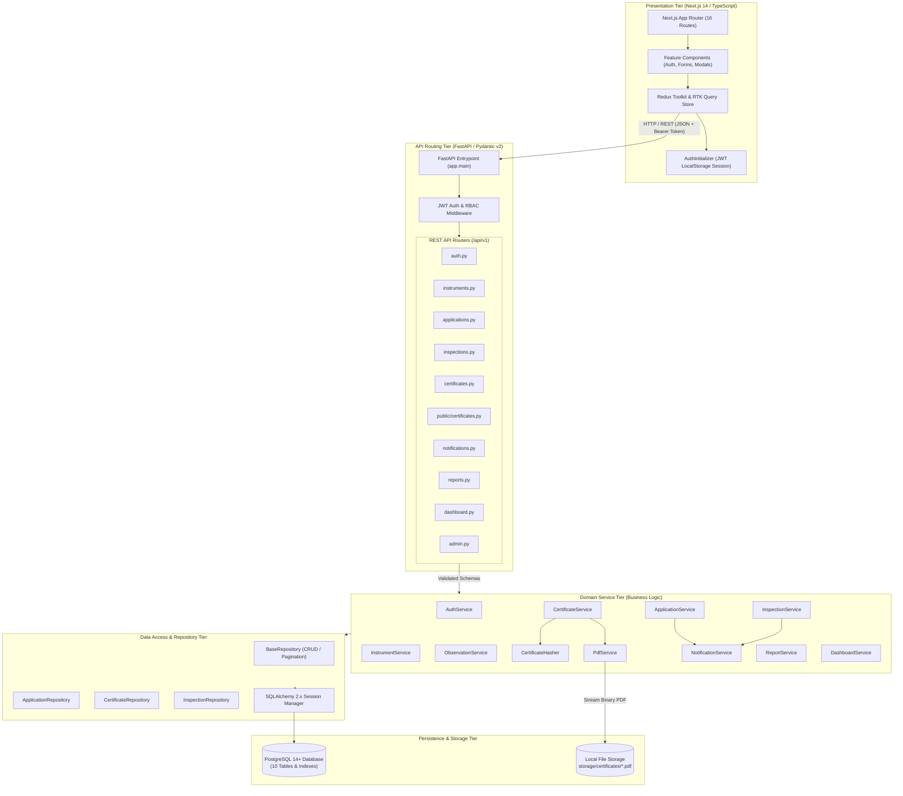

---

## 5. Architectural Invariant Summary

1. **Strict Linearity**: Verification applications strictly follow forward lifecycle transitions. Backward state reversals are prohibited.
2. **Non-Destructive Re-Verification**: Certificate expiration does not alter previous application records. A re-verification request creates an independent application linked to the same physical instrument.
3. **Decoupled Binary Storage**: Relational records and audit logs reside in PostgreSQL; binary PDF certificates are stored on the local filesystem without external cloud bloat.
4. **Zero-Trust Public Verification**: The public verification endpoint requires no authentication and provides real-time verification status while strictly redacting sensitive stakeholder data.
